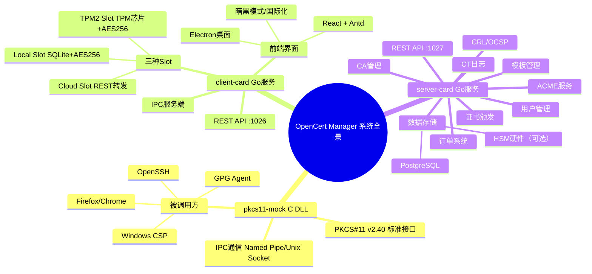
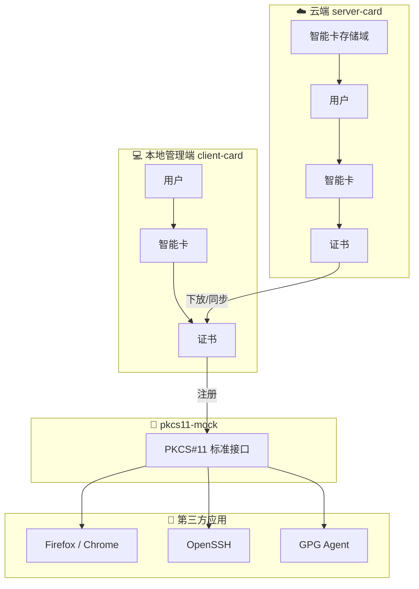
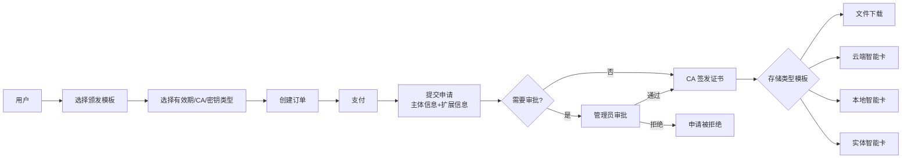
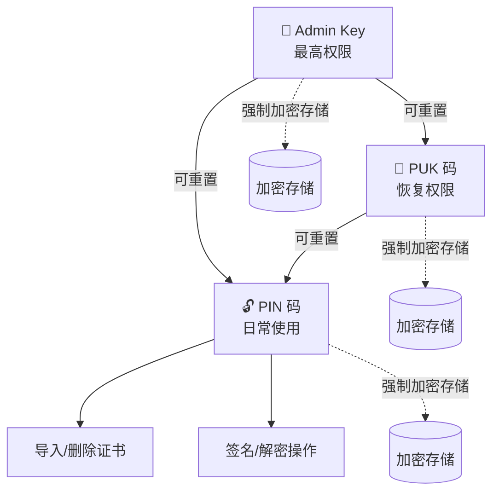

# OpenCert Manager — 项目总览

> 项目名称：OpenCert Manager
> 文档版本：v2.0.0
> 最后更新：2026-04-17

---

## 一、项目定位

OpenCert Manager 是一套完整的 **CA + 智能卡 + X509/GPG/SSH 证书管理平台**，涵盖云端证书颁发管理、本地虚拟智能卡驱动、PKCS#11 标准兼容三大核心能力。

### 核心价值

- **全生命周期证书管理**：从 CA 创建、模板配置、证书颁发、吊销到续期的完整闭环
- **多类型证书支持**：X509 证书、GPG 密钥、SSH 密钥，以及 TOTP/FIDO/登录信息等安全凭据
- **虚拟智能卡驱动**：通过 PKCS#11 标准接口，将云端/本地证书注册到操作系统，供第三方应用调用
- **多级安全保障**：支持 TPM 硬件保护、云端 HSM、本地加密三种安全等级
- **企业级 PKI 服务**：ACME 自动化、CRL/OCSP 吊销服务、CT 透明度日志

---

## 二、系统全景

---

## 三、三大组件概述

### 3.1 云端平台（server-card）

完整的企业级 CA 管理平台，提供证书全生命周期管理：

| 功能模块 | 说明 |
|---------|------|
| 用户管理 | 注册、登录、TOTP 双因素、角色权限、公钥对管理 |
| 存储区域 | 本地数据库存储 / HSM 硬件存储，支持自定义驱动 |
| 智能卡管理 | 云端虚拟智能卡，按存储区域和用户组织 |
| CA 管理 | 创建/导入 CA、证书链管理、吊销列表管理 |
| 证书颁发 | 基于模板的证书颁发，支持 X509/GPG/SSH 三种类型 |
| 模板体系 | 颁发模板、主体模板、扩展模板、密钥用途模板、存储类型模板、证书拓展模板 |
| 订单系统 | 证书购买、申请审批、支付集成 |
| PKI 服务 | ACME 自动化、CRL 分发、OCSP 响应、CA 证书下载 |
| CT 日志 | 证书透明度提交与查询 |
| OID 管理 | 自定义 OID（扩展密钥用途、主体字段、EV 声明、ASN.1 扩展） |
| 吊销服务 | 按 CA 配置 CRL/OCSP/CAIssuer 服务，支持自定义路径和定时更新 |
| 支付系统 | 多支付插件、充值、退款、订单管理 |
| 门户首页 | 项目功能介绍展示 |

### 3.2 本地管理端（client-card）

桌面端证书和智能卡管理工具：

| 功能模块 | 说明 |
|---------|------|
| 用户管理 | 本地/云端用户登录、个人信息管理 |
| 智能卡管理 | 本地虚拟卡槽管理（Local/TPM2/Cloud 三种类型） |
| 证书管理 | 导入/导出/删除证书，支持 PKCS#12、PEM 等格式 |
| PKI 工具 | CSR 生成、本地 CA 管理、证书签发、自签名证书 |
| TOTP 管理 | TOTP/HOTP 验证器，添加和查看验证码 |
| 云端同步 | 云端证书下发到本地/智能卡，自动/手动同步 |
| 系统注册 | 通过 pkcs11-mock 将证书注册到操作系统 |

### 3.3 PKCS#11 驱动（pkcs11-mock）

标准 PKCS#11 v2.40 兼容的 C 语言 DLL/SO/DYLIB：

| 能力 | 说明 |
|------|------|
| 密钥类型 | RSA 1024-8192、ECC P-256/384/521、Brainpool、Ed/X25519、SM2 |
| 摘要算法 | SHA-1/256/384/512、SHA3、MD5、MD4、SM3 |
| 加密算法 | AES-128/256、RC4、ChaCha20、SM4 |
| 证书类型 | X509、GPG、SSH |
| 片上生成 | 支持片上生成密钥和 CSR，确保密钥安全 |
| IPC 通信 | Named Pipe (Windows) / Unix Socket (Linux/macOS) |

---

## 四、技术栈

| 层级 | 技术选型 | 说明 |
|------|---------|------|
| 云端后端 | Go 1.22+ / net/http 标准库 | 零依赖，新 ServeMux 路由 |
| 云端数据库 | PostgreSQL | 高并发，成熟生态 |
| 本地后端 | Go 1.22+ / net/http 标准库 | 零依赖 |
| 本地数据库 | SQLite (SQLCipher) | 零依赖，单文件，全库加密 |
| PKCS#11 驱动 | C / CMake | 跨平台 DLL/SO/DYLIB |
| 前端框架 | React 18 + TypeScript | 类型安全，成熟生态 |
| UI 组件库 | Ant Design 5.x | 企业级组件 |
| 状态管理 | Zustand | 轻量，无样板代码 |
| 路由 | React Router v6 | 标准方案 |
| 国际化 | i18next | 中/英双语 |
| 桌面端 | Electron | 跨平台，复用 Web 代码 |
| 构建工具 | Vite | 快速热更新 |
| TPM 支持 | go-tpm (Win/Linux) / Security.framework (macOS) | 硬件安全 |

---

## 五、核心设计原则

1. **接口驱动**：所有 Slot 类型实现统一的 `SlotProvider` 接口，后期可无缝扩展新卡片类型
2. **最小权限**：私钥永不明文传输，本地加密存储，云端签名私钥不离开服务器
3. **零依赖本地**：client-card 使用 SQLite，无需额外数据库服务
4. **标准兼容**：严格遵循 PKCS#11 v2.40 标准，确保与现有 PKI 生态兼容
5. **分层加密**：三层加密架构保护私钥（用户密码 → 卡片主密钥 → 临时密钥 → 私钥）
6. **多级安全**：高安全性（TPM 不可导出）、中安全性（TPM 加密可恢复）、低安全性（密码加密可恢复）

---

## 六、数据流概览

### 证书颁发流程

### 智能卡 PIN/PUK/Admin Key 层级

---

## 七、文档索引

| 文档 | 文件名 | 内容 |
|------|--------|------|
| 项目总览 | `01-OVERVIEW.MD` | 本文档，项目定位与全景 |
| 架构设计 | `02-ARCHITECTURE.MD` | 系统架构、组件交互、IPC 协议 |
| 云端平台 | `03-CLOUD-PLATFORM.MD` | server-card 全部功能详细设计 |
| 本地管理端 | `04-LOCAL-MANAGER.MD` | client-card 功能设计 |
| PKCS#11 驱动 | `05-PKCS11-DRIVER.MD` | pkcs11-mock 驱动设计与功能映射 |
| 安全设计 | `06-SECURITY.MD` | 加密方案、威胁模型、安全策略 |
| API 规范 | `07-API.MD` | 完整 REST API 接口规范 |
| 前端设计 | `08-FRONTEND.MD` | 前端架构、页面规划、侧边栏菜单 |
| 数据库设计 | `09-DATABASE.MD` | 数据模型、表结构、索引设计 |
| 部署运维 | `10-DEPLOY.MD` | 构建、配置、部署、运维指南 |
| 开发路线图 | `11-ROADMAP.MD` | 分阶段计划、里程碑、待办事项 |
