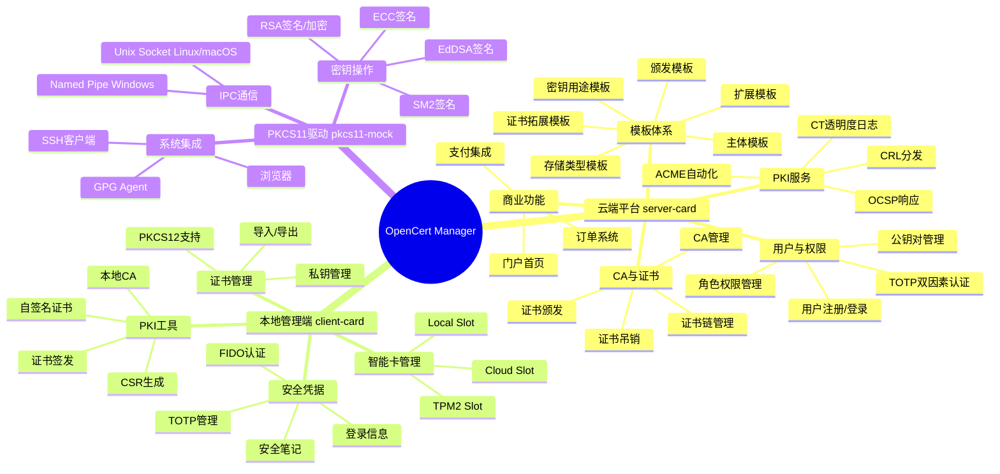
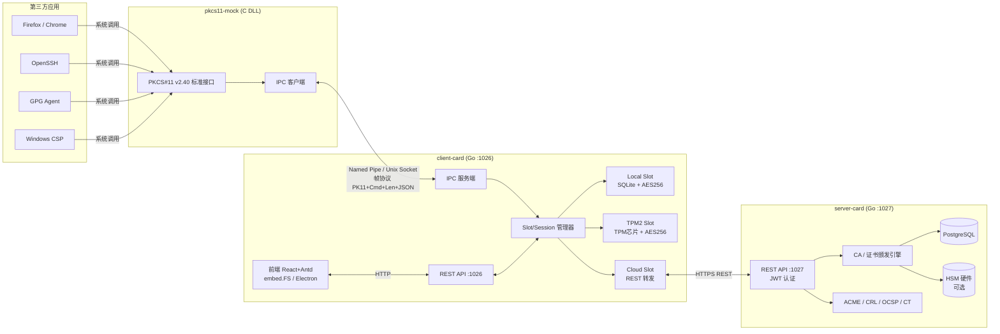
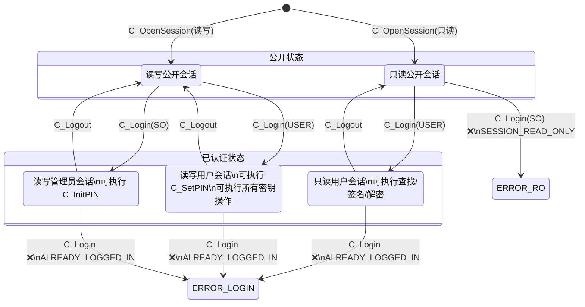

# OpenCert Manager — 系统架构设计

> 文档版本：v2.0.0
> 最后更新：2026-04-17

---

## 一、系统架构总览



---

## 二、组件交互架构



---

## 三、Slot 类型架构

### 3.1 统一接口设计

所有 Slot 类型实现统一的 `SlotProvider` 接口，确保可扩展性：

```go
type SlotProvider interface {
    // 基本信息
    GetSlotInfo() SlotInfo
    GetTokenInfo() TokenInfo
    GetMechanismList() []Mechanism

    // 会话管理
    OpenSession(flags uint32) (SessionHandle, error)
    CloseSession(handle SessionHandle) error
    CloseAllSessions() error
    GetSessionInfo(handle SessionHandle) (SessionInfo, error)

    // 认证
    Login(handle SessionHandle, userType uint32, pin []byte) error
    Logout(handle SessionHandle) error
    InitPIN(handle SessionHandle, pin []byte) error
    SetPIN(handle SessionHandle, oldPin, newPin []byte) error

    // 对象操作
    FindObjectsInit(handle SessionHandle, template []Attribute) error
    FindObjects(handle SessionHandle, maxCount int) ([]ObjectHandle, error)
    FindObjectsFinal(handle SessionHandle) error
    GetAttributeValue(handle SessionHandle, obj ObjectHandle, attrs []Attribute) ([]Attribute, error)
    CreateObject(handle SessionHandle, template []Attribute) (ObjectHandle, error)
    DestroyObject(handle SessionHandle, obj ObjectHandle) error

    // 密钥操作
    SignInit(handle SessionHandle, mechanism Mechanism, key ObjectHandle) error
    Sign(handle SessionHandle, data []byte) ([]byte, error)
    DecryptInit(handle SessionHandle, mechanism Mechanism, key ObjectHandle) error
    Decrypt(handle SessionHandle, data []byte) ([]byte, error)
    EncryptInit(handle SessionHandle, mechanism Mechanism, key ObjectHandle) error
    Encrypt(handle SessionHandle, data []byte) ([]byte, error)
    GenerateKeyPair(handle SessionHandle, mechanism Mechanism, pubTemplate, privTemplate []Attribute) (ObjectHandle, ObjectHandle, error)
}
```

### 3.2 三种 Slot 对比

| 特性 | Local Slot | TPM2 Slot | Cloud Slot |
|------|-----------|-----------|-----------|
| 私钥存储位置 | 本地 SQLite（加密） | 本地 SQLite（TPM 封装加密） | 云端服务器 |
| 签名操作 | 本地执行 | 本地执行（TPM 参与解密） | 云端执行，私钥不离开服务器 |
| 离线可用 | ✅ 完全离线 | ✅ 完全离线 | ❌ 需要网络 |
| 硬件保护 | ❌ 纯软件 | ✅ TPM 芯片保护 | ✅ 服务器端保护 |
| 跨设备使用 | ❌ 仅本机 | ❌ 仅本机（TPM 绑定） | ✅ 任意设备 |
| 密钥可恢复 | 取决于安全等级 | 高安全性不可恢复 | ✅ 云端备份 |
| 实现复杂度 | 低 | 中 | 高 |

---

## 四、IPC 协议设计

### 4.1 传输层

| 平台 | 传输方式 | 路径 | 安全隔离 |
|------|---------|------|---------|
| Windows | Named Pipe | `\\.\pipe\opencert-pkcs11` | DACL（当前用户 + SYSTEM） |
| Linux | Unix Domain Socket | `/tmp/opencert-pkcs11.sock` | 文件权限 0600 |
| macOS | Unix Domain Socket | `/tmp/opencert-pkcs11.sock` | 文件权限 0600 |

### 4.2 帧格式

```
┌──────────┬──────────┬──────────┬─────────────────┐
│ Magic    │ Command  │ Length   │ JSON Payload     │
│ 4 bytes  │ 4 bytes  │ 4 bytes  │ N bytes          │
│ "PK11"   │ BigEndian│ BigEndian│ UTF-8 JSON       │
└──────────┴──────────┴──────────┴─────────────────┘
帧头共 12 字节
```

### 4.3 特殊命令

| 命令 | 代码 | 说明 |
|------|------|------|
| CmdPing | 0x0000 | 心跳，30 秒空闲发送，3 次无响应重连 |
| CmdHandshake | 0x00FF | 版本协商，C_Initialize 阶段交换协议版本号 |

### 4.4 响应格式

```json
{
  "rv": 0,
  "data": { ... }
}
```

其中 `rv` 为 PKCS#11 标准返回值（CKR_OK = 0）。

---

## 五、会话状态机



---

## 六、操作状态机

### 6.1 单操作状态

| 触发函数 | 进入状态 | 结束函数 | 退出状态 |
|---------|---------|---------|---------|
| FindObjectsInit | FIND | FindObjectsFinal | NONE |
| EncryptInit | ENCRYPT | Encrypt / EncryptFinal | NONE |
| DecryptInit | DECRYPT | Decrypt / DecryptFinal | NONE |
| DigestInit | DIGEST | Digest / DigestFinal | NONE |
| SignInit | SIGN | Sign / SignFinal | NONE |
| VerifyInit | VERIFY | Verify / VerifyFinal | NONE |

### 6.2 双操作叠加

同一时刻支持两种操作并行（如 SIGN_ENCRYPT、DECRYPT_DIGEST），通过全局状态变量管理：

| 当前状态 | 叠加触发 | 组合状态 |
|---------|---------|---------|
| ENCRYPT | DigestInit | DIGEST_ENCRYPT |
| ENCRYPT | SignInit | SIGN_ENCRYPT |
| DECRYPT | DigestInit | DECRYPT_DIGEST |
| DECRYPT | VerifyInit | DECRYPT_VERIFY |

组合状态中某一操作完成后，退回单操作状态。

---

## 七、目录结构

```
PKCS11Driver/
├── clients/                          # client-card 本地管理端
│   ├── cmd/clients/main.go           # 启动入口
│   ├── configs/config.go             # 配置加载（YAML/ENV）
│   ├── internal/
│   │   ├── card/
│   │   │   ├── engine.go             # SlotProvider 接口定义
│   │   │   ├── manager.go            # Slot/Session 管理器
│   │   │   ├── local/                # Local Slot 实现
│   │   │   ├── tpm2/                 # TPM2 Slot 实现
│   │   │   └── cloud/                # Cloud Slot 实现
│   │   ├── crypto/                   # 加密工具（AES/HMAC/bcrypt）
│   │   ├── ipc/                      # IPC 服务（Named Pipe/Unix Socket）
│   │   ├── storage/                  # SQLite 存储层
│   │   ├── tpm/                      # TPM 抽象接口与平台实现
│   │   └── api/                      # REST API Handler
│   ├── pkg/pkcs11types/              # PKCS#11 常量和类型
│   ├── ui/dist/                      # 前端构建产物（embed.FS）
│   └── test/                         # 测试文件
├── servers/                          # server-card 云端平台
│   ├── cmd/servers/main.go           # 启动入口
│   ├── configs/config.go             # 配置加载
│   └── internal/
│       ├── api/                      # REST API Handler
│       ├── auth/                     # JWT 认证
│       ├── ca/                       # CA 引擎
│       ├── cert/                     # 证书颁发/管理
│       ├── template/                 # 模板管理
│       ├── order/                    # 订单系统
│       ├── payment/                  # 支付插件
│       ├── acme/                     # ACME 服务
│       ├── revoke/                   # CRL/OCSP 服务
│       ├── ct/                       # CT 日志
│       └── storage/                  # PostgreSQL 存储层
├── drivers/                          # pkcs11-mock PKCS#11 驱动
│   ├── src/                          # C 源代码
│   ├── include/                      # PKCS#11 头文件
│   └── CMakeLists.txt                # CMake 构建
├── front/                            # 前端源代码
│   ├── src/
│   │   ├── pages/                    # 页面组件
│   │   ├── components/               # 通用组件
│   │   ├── store/                    # Zustand 状态管理
│   │   ├── services/                 # API 调用层
│   │   ├── i18n/                     # 国际化
│   │   └── layouts/                  # 布局组件
│   └── package.json
├── docs/                             # 设计文档
└── roadmap/                          # 原始需求与路线图
```

---

## 八、关键设计决策

| 决策点 | 选择 | 原因 |
|--------|------|------|
| IPC 协议格式 | JSON | 调试方便，性能对本地 IPC 足够 |
| IPC 传输层 | Named Pipe / Unix Socket | 无需网络端口，系统级安全隔离 |
| 本地数据库 | SQLite (SQLCipher) | 零依赖，单文件，支持全库加密 |
| 云端数据库 | PostgreSQL | 高并发，成熟生态 |
| 加密方案 | AES-256-GCM + HMAC-SHA256 | 标准、安全、Go 原生支持 |
| 密码哈希 | Argon2id（优先）/ bcrypt（兼容） | 抗暴力破解，内存硬函数 |
| API 框架 | Go 1.22 标准库 net/http | 零依赖，新 ServeMux 已足够 |
| 前端框架 | React 18 + Ant Design 5 | 成熟生态，企业级组件 |
| 桌面方案 | Electron | 跨平台，复用 Web 代码 |
| TPM 库 | go-tpm (Win/Linux) / Security.framework (macOS) | 官方维护，跨平台 |
