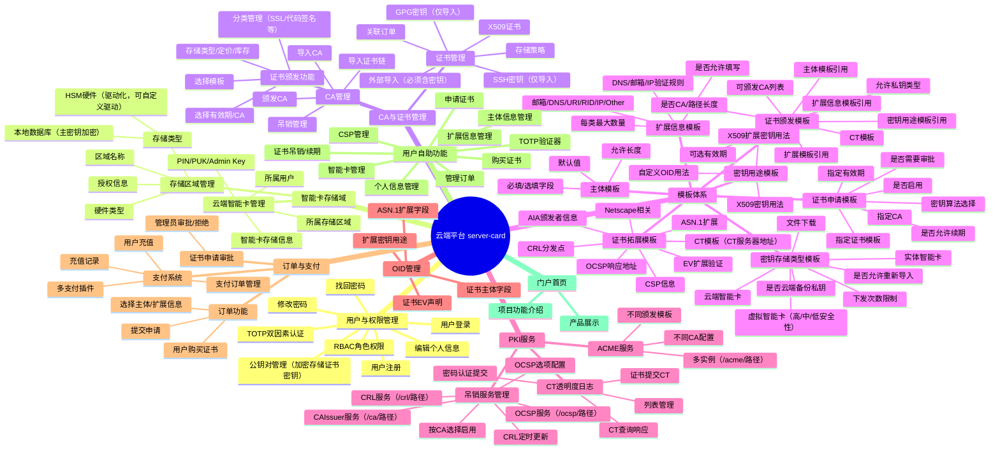
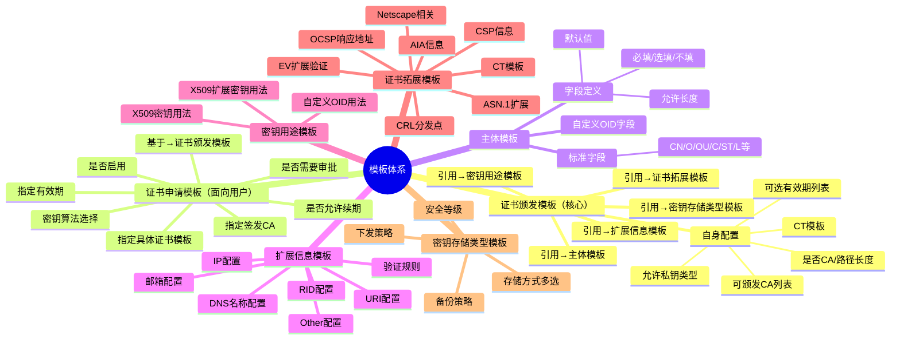
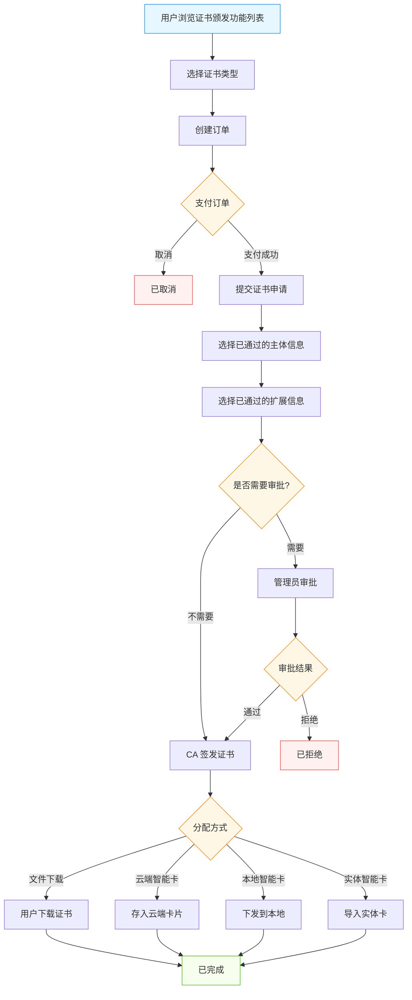
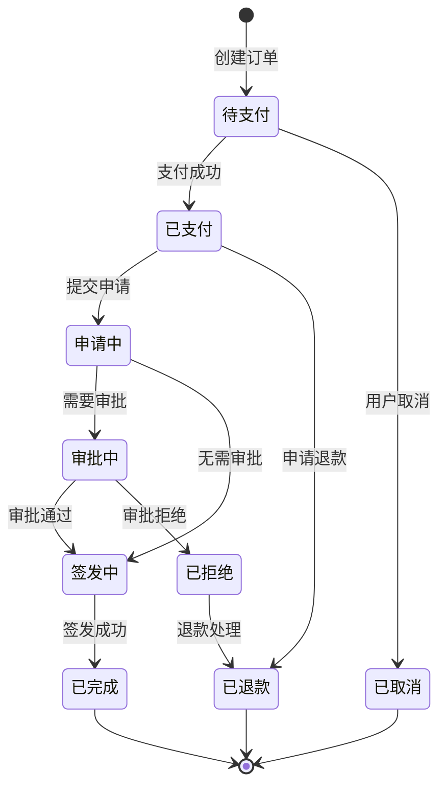

# OpenCert Manager — 云端平台功能设计（server-card）

> 文档版本：v2.0.0
> 最后更新：2026-04-17

---

## 一、云端平台功能全景

---

## 二、用户与权限管理

### 2.1 用户管理

| 功能 | 说明 |
|------|------|
| 用户注册 | 邮箱注册，邮箱验证激活 |
| 用户登录 | 邮箱+密码登录，支持 TOTP 双因素 |
| 修改密码 | 需验证旧密码 |
| 找回密码 | 邮箱验证码重置 |
| TOTP 认证 | 绑定 TOTP 设备，登录时二次验证 |
| 个人信息 | 编辑显示名称、邮箱、头像等 |
| 公钥对管理 | 用于加密存储证书密钥，支持上传/生成公钥对 |

### 2.2 TOTP 管理

- 允许存储用户的 TOTP 信息，作为 TOTP/HOTP 验证器
- 支持添加、删除、查看 TOTP 条目
- 支持标准 TOTP URI 格式导入

### 2.3 角色权限（RBAC）

| 角色 | 权限范围 |
|------|---------|
| `super_admin` | 系统级管理，所有功能 |
| `admin` | CA 管理、模板管理、证书审批、用户管理 |
| `operator` | 证书颁发、订单处理、吊销操作 |
| `user` | 自助功能：购买证书、管理自己的卡片和证书 |
| `readonly` | 只读访问 |

---

## 三、智能卡存储域

### 3.1 存储区域管理

存储区域定义了证书密钥的物理存储位置：

| 字段 | 说明 |
|------|------|
| 区域名称 | 存储区域的显示名称 |
| 存储类型 | `database`（本地数据库）/ `hsm`（HSM 硬件） |
| 主密钥配置 | 数据库类型：主密钥加密方案 |
| 硬件类型 | HSM 类型：如 SoftHSM、Thales Luna、AWS CloudHSM |
| 驱动信息 | HSM 驱动路径和配置（支持自定义驱动） |
| 授权信息 | HSM 连接凭据（加密存储） |

### 3.2 云端智能卡

| 字段 | 说明 |
|------|------|
| 卡片 UUID | 全局唯一标识 |
| 所属存储区域 | 关联的存储区域 |
| 所属用户 | 卡片拥有者 |
| 卡片名称 | 显示名称 |
| PIN 码 | 日常操作密码（强制加密存储） |
| PUK 码 | 可重置 PIN 码（强制加密存储） |
| Admin Key | 最高权限密钥，可重置 PIN 和 PUK（强制加密存储） |
| 创建日期 | 卡片创建时间 |
| 有效期 | 卡片过期时间 |
| 备注信息 | 自定义备注 |

### 3.3 PIN/PUK/Admin Key 安全要求

- **PIN 码**：导入/删除证书、签名/解密操作时需要验证
- **PUK 码**：可重置 PIN 码，PIN 码错误次数超限后使用 PUK 解锁
- **Admin Key**：可重置 PUK 和 PIN 码
- **强制加密**：三者均不以明文存储，使用加密方案保护，而非仅作为验证哈希

---

## 四、CA 与证书管理

### 4.1 CA 管理

| 功能 | 说明 |
|------|------|
| 导入 CA | 导入外部 CA 证书和私钥 |
| 颁发 CA | 通过颁发功能创建新 CA（根 CA 或中间 CA） |
| 证书链导入 | 导入完整证书链 |
| 吊销管理 | 管理当前 CA 的吊销证书列表（CRL） |
| CA 状态 | 启用/禁用/过期状态管理 |

### 4.2 证书管理

#### 证书类型支持

| 类型 | CA 颁发 | 外部导入 | 说明 |
|------|---------|---------|------|
| X509 证书 | ✅ | ✅（必须含密钥） | 完整 CA 生命周期管理 |
| GPG 密钥 | ❌ | ✅（必须含密钥） | 仅导入，不参与 CA 操作 |
| SSH 密钥 | ❌ | ✅（必须含密钥） | 仅导入，不参与 CA 操作 |

#### 证书信息字段

| 字段 | 说明 |
|------|------|
| 证书内容 | 公开部分（PEM/DER） |
| 私钥数据 | 加密存储的私钥 |
| 所属 CA | 签发此证书的 CA |
| 所属模板 | 使用的颁发模板 |
| 所属用户 | 证书拥有者 |
| 所属卡槽/智能卡 | 存储位置 |
| 证书主体 | Subject DN |
| 颁发者 | Issuer DN |
| 有效期 | NotBefore / NotAfter |
| 密钥用法 | Key Usage |
| 扩展用法 | Extended Key Usage |
| 扩展 OID | 自定义扩展 |
| 关联订单 | 购买订单号 |

#### 证书存储策略

| 策略 | 说明 |
|------|------|
| 允许直接下载 | 用户可下载证书和私钥文件 |
| 导入云端智能卡 | 证书存储到云端虚拟智能卡 |
| 导入本地智能卡 | 通过 client-card 导入本地虚拟智能卡 |
| 导入实体智能卡 | 导入物理智能卡设备 |

### 4.3 证书颁发功能

证书颁发是面向最终用户的产品化功能：

| 配置项 | 说明 |
|--------|------|
| 选择模板 | 关联证书颁发模板 |
| 有效期 | 可选有效期列表 |
| 签发 CA | 指定签发的 CA |
| 存储类型 | 密钥存储类型模板 |
| 定价 | 证书价格 |
| 库存 | 可颁发数量 |
| 分类 | SSL 证书、代码签名证书、邮件证书等 |

---

## 五、模板体系

### 5.1 模板关系

### 5.2 证书颁发模板

| 字段 | 类型 | 说明 |
|------|------|------|
| 模板名称 | string | 模板显示名称 |
| 是否 CA | bool | 颁发的证书是否为 CA 证书 |
| 路径长度 | int | CA 路径长度约束（pathLenConstraint） |
| 可选有效期 | []string | 如 `["30d", "60d", "90d", "1y", "2y", "3y"]`，支持自定义输入 |
| CT 模板 | ref | 关联的 CT 模板（CT 服务器地址列表） |
| 允许私钥类型 | []string | 如 `["RSA2048", "RSA4096", "ECC_P256", "ECC_P384"]` |
| 可颁发 CA 列表 | []ref | 允许使用哪些 CA 签发 |
| 主体模板 | ref | 关联的主体模板 |
| 扩展信息模板 | ref | 关联的扩展信息模板 |
| 密钥用途模板 | ref | 关联的密钥用途模板 |
| 证书拓展模板 | ref | 关联的证书拓展模板 |

### 5.3 主体模板

定义证书主体（Subject）中各字段的规则：

| 字段 | 配置项 | 说明 |
|------|--------|------|
| Common Name (CN) | 必填/选填/不填、默认值、最大长度 | 通用名称 |
| Organization (O) | 必填/选填/不填、默认值、最大长度 | 组织名称 |
| Organizational Unit (OU) | 必填/选填/不填、默认值、最大长度 | 部门名称 |
| Country (C) | 必填/选填/不填、默认值、允许值列表 | 国家代码 |
| State (ST) | 必填/选填/不填、默认值、最大长度 | 省/州 |
| Locality (L) | 必填/选填/不填、默认值、最大长度 | 城市 |
| Email | 必填/选填/不填、格式验证 | 邮箱地址 |
| Serial Number | 必填/选填/不填 | 序列号 |
| 自定义 OID 字段 | 通过 OID 管理添加 | 自定义主体字段 |

### 5.4 扩展信息模板（SAN）

| 类型 | 配置项 |
|------|--------|
| 邮箱 (rfc822Name) | 是否允许、最大数量、是否需要邮箱验证（发送验证码） |
| DNS 名称 (dNSName) | 是否允许、最大数量、是否需要验证（TXT/HTTP 验证） |
| URI (uniformResourceIdentifier) | 是否允许、最大数量 |
| RID (registeredID) | 是否允许、最大数量 |
| IP 地址 (iPAddress) | 是否允许、最大数量、是否需要验证（TXT/HTTP 验证） |
| Other Name | 是否允许、最大数量 |

### 5.5 密钥用途模板

#### X509 密钥用法（Key Usage）

- digitalSignature（数字签名）
- nonRepudiation（不可否认）
- keyEncipherment（密钥加密）
- dataEncipherment（数据加密）
- keyAgreement（密钥协商）
- keyCertSign（证书签名）
- cRLSign（CRL 签名）
- encipherOnly（仅加密）
- decipherOnly（仅解密）

#### X509 扩展密钥用法（Extended Key Usage）

- serverAuth（服务器认证）
- clientAuth（客户端认证）
- codeSigning（代码签名）
- emailProtection（邮件保护）
- timeStamping（时间戳）
- OCSPSigning（OCSP 签名）
- 自定义 OID（通过 OID 管理添加）

### 5.6 证书拓展模板

| 拓展类型 | 说明 |
|---------|------|
| CRL 分发点 | CRL 下载地址列表 |
| OCSP 响应地址 | OCSP 服务器地址列表 |
| AIA 颁发者信息 | CA 证书下载地址 |
| CSP 信息 | 证书服务提供者信息 |
| Netscape 相关 | Netscape 证书类型、注释等（兼容旧系统） |
| EV 扩展验证 | EV 证书策略 OID、组织信息等 |
| ASN.1 扩展 | 自定义 ASN.1 编码扩展字段 |
| CT 模板 | 不同 CT 服务器地址列表 |

每种拓展类型可以创建多个实例，在证书颁发模板中按需添加。

### 5.7 密钥存储类型模板

| 配置项 | 类型 | 说明 |
|--------|------|------|
| 存储方式 | 多选 | 文件下载 / 云端智能卡 / 实体智能卡 / 虚拟智能卡 |
| 虚拟卡安全等级 | 单选 | 高安全性 / 中安全性 / 低安全性 |
| 允许重新导入 | bool | 高安全性不支持重新导入 |
| 云端备份私钥 | bool | 实体/云端智能卡和中低安全性可选 |
| 支持重新下发 | bool | 备份了私钥的证书可选 |
| 下发次数 | int | 允许下发的次数（文件下载为无限次） |

**安全等级说明**：

| 等级 | 密钥存储 | 可恢复 | 可导出 |
|------|---------|--------|--------|
| 高安全性 | TPM 内部（不可导出） | ❌ | ❌ |
| 中安全性 | 本地 DB + TPM 加密 + 用户云端公钥加密 | ✅ | ❌ |
| 低安全性 | 本地 DB + 密码加密 + 用户云端公钥加密 | ✅ | ❌ |

**规则**：如果不允许文件下载，则密钥必须在可用的智能卡上生成（片上生成）。

### 5.8 证书申请模板

在证书颁发模板基础上，面向用户的申请配置：

| 字段 | 说明 |
|------|------|
| 关联证书颁发模板 | 基于哪个颁发模板 |
| 指定有效期 | 固定有效期或可选列表 |
| 指定签发 CA | 固定 CA 或可选列表 |
| 是否启用 | 是否对用户可见 |
| 是否允许续期 | 证书到期后是否可续期 |
| 是否需要审批 | 用户申请后是否需要管理员审批 |
| 密钥算法 | RSA2048~4096、ECC P256~P521 等可选列表 |

---

## 六、OID 管理

允许添加和管理自定义 OID，用途分类：

| 用途 | 说明 | 示例 |
|------|------|------|
| 扩展密钥用途 | 自定义 EKU OID | 1.3.6.1.4.1.xxxxx.1 |
| 证书主体字段 | 自定义 Subject 字段 | 2.5.4.xxxxx |
| 证书 EV 声明 | EV 策略 OID | 2.16.840.1.xxxxx |
| ASN.1 扩展字段 | 自定义证书扩展 | 1.2.3.4.xxxxx |

每个 OID 记录：

| 字段 | 说明 |
|------|------|
| OID 值 | 点分十进制格式 |
| 显示名称 | 人类可读名称 |
| 用途分类 | 上述四种之一 |
| 描述 | 详细说明 |
| ASN.1 类型 | UTF8String / IA5String / BOOLEAN / INTEGER 等 |

---

## 七、PKI 服务

### 7.1 吊销服务管理

按 CA 配置吊销相关服务：

| 服务 | URL 格式 | 说明 |
|------|---------|------|
| CRL 服务 | `/crl/<自定义路径>` | CRL 文件分发 |
| OCSP 服务 | `/ocsp/<自定义路径>` | OCSP 在线查询 |
| CAIssuer 服务 | `/ca/<自定义路径>` | CA 证书下载 |

配置选项：

| 选项 | 说明 |
|------|------|
| 选择 CA | 为哪个 CA 启用服务 |
| 启用的服务 | 可勾选只启用部分（如只启用 CRL） |
| CRL 更新时间 | 定时自动更新 CRL（如每 24 小时） |
| CRL 有效期 | CRL 的 nextUpdate 时间 |
| OCSP 响应有效期 | OCSP 响应缓存时间 |
| OCSP 签名证书 | OCSP 响应签名使用的证书 |

### 7.2 ACME 服务

支持在 `/acme/<自定义路径>` 下启动多个 ACME 服务实例：

| 配置项 | 说明 |
|--------|------|
| 路径 | ACME 服务的 URL 路径 |
| 签发 CA | 使用哪个 CA 签发 |
| 证书颁发模板 | 使用哪个颁发模板 |
| 允许的域名验证方式 | HTTP-01 / DNS-01 / TLS-ALPN-01 |
| 证书有效期 | 默认有效期 |
| 速率限制 | 每账户/每域名的颁发频率限制 |

### 7.3 CT 透明度日志

| 功能 | 说明 |
|------|------|
| 证书提交 | 将颁发的证书提交到 CT 日志 |
| CT 查询 | 支持外部查询已提交的 CT 记录 |
| 认证提交 | 支持密码认证才能提交（防止滥用） |
| 列表管理 | 管理已提交的 CT 记录列表 |

---

## 八、订单与支付系统

### 8.1 订单流程

**订单状态流转**：

### 8.2 主体信息管理

- 用户或管理员可新增主体信息
- 选择主体模板并完善各字段
- 审核状态：默认"审核中"，管理员通过后才能使用
- 通过的主体信息可在证书申请时直接选用

### 8.3 扩展信息管理

| 验证类型 | 验证方式 | 说明 |
|---------|---------|------|
| 域名验证 | TXT 记录验证 | 在 DNS 中添加指定 TXT 记录 |
| 域名验证 | HTTP 验证 | 在指定 URL 放置验证文件 |
| 邮箱验证 | 验证码验证 | 发送验证码到邮箱 |
| IP 验证 | TXT/HTTP 验证 | 类似域名验证 |

验证信息存储验证时间，根据扩展信息模板规定的有效期判断是否仍然有效。

### 8.4 支付系统

| 功能 | 说明 |
|------|------|
| 支付插件管理 | 添加/配置多种支付插件（Stripe、PayPal、支付宝等） |
| 支付订单管理 | 查看所有支付记录 |
| 用户充值 | 支持余额充值 |
| 充值记录 | 管理充值历史 |
| 退款 | 支持订单退款 |

---

## 九、用户自助功能

用户登录后可使用的自助功能：

| 功能 | 说明 |
|------|------|
| 个人信息管理 | 编辑个人资料、修改密码、管理 TOTP |
| 主体信息管理 | 新增/编辑主体信息，等待审核 |
| 扩展信息管理 | 域名/邮箱/IP 验证管理 |
| 购买证书 | 浏览证书产品，创建订单 |
| 管理订单 | 查看订单状态、支付、取消 |
| 申请证书 | 使用订单申请证书，选择主体和扩展信息 |
| 智能卡管理 | 管理自己的云端智能卡 |
| CSP 管理 | 管理证书服务提供者配置 |
| 证书吊销 | 申请吊销自己的证书 |
| 证书续期 | 对即将到期的证书申请续期 |
| TOTP 验证器 | 管理 TOTP/HOTP 条目 |

---

## 十、门户首页

门户首页是面向公众的展示页面：

| 区域 | 内容 |
|------|------|
| Hero 区域 | 项目名称、核心价值主张、CTA 按钮 |
| 功能介绍 | 证书管理、智能卡、PKCS#11 驱动等核心功能卡片 |
| 产品列表 | 可购买的证书类型概览 |
| 安全特性 | TPM 保护、端到端加密等安全亮点 |
| 技术规格 | 支持的算法、标准、平台 |
| 页脚 | 联系方式、文档链接、法律信息 |
