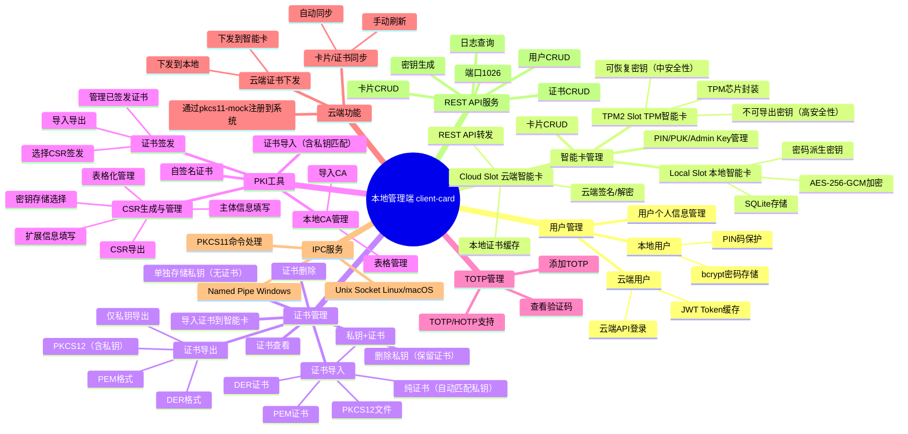
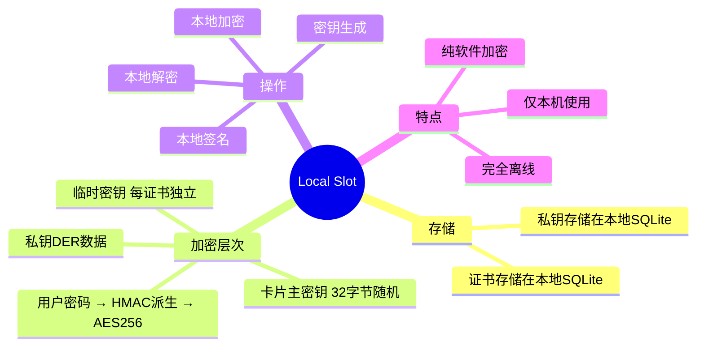
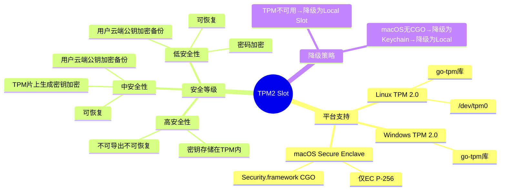
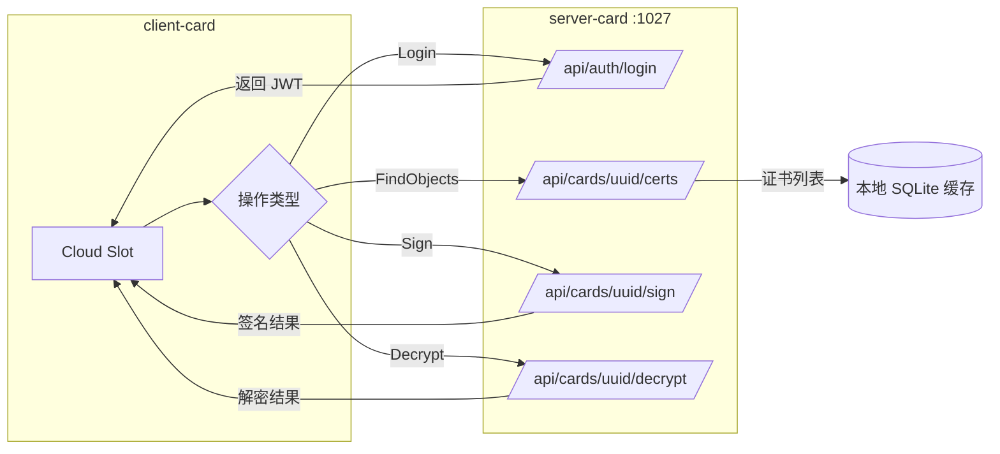
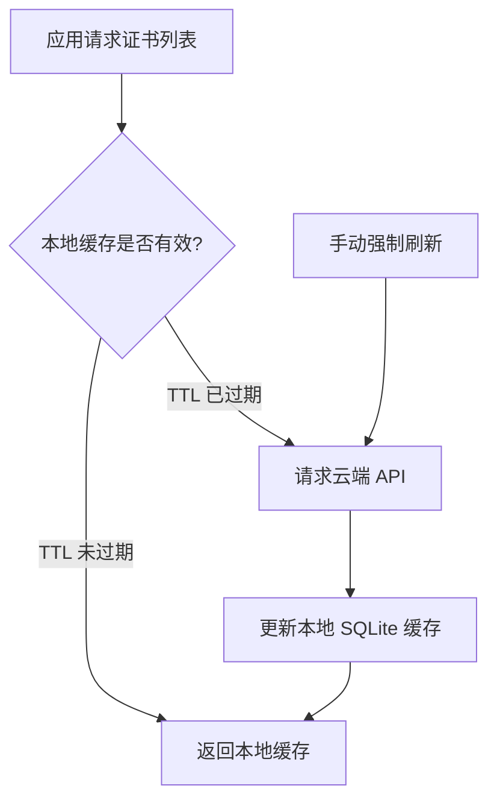
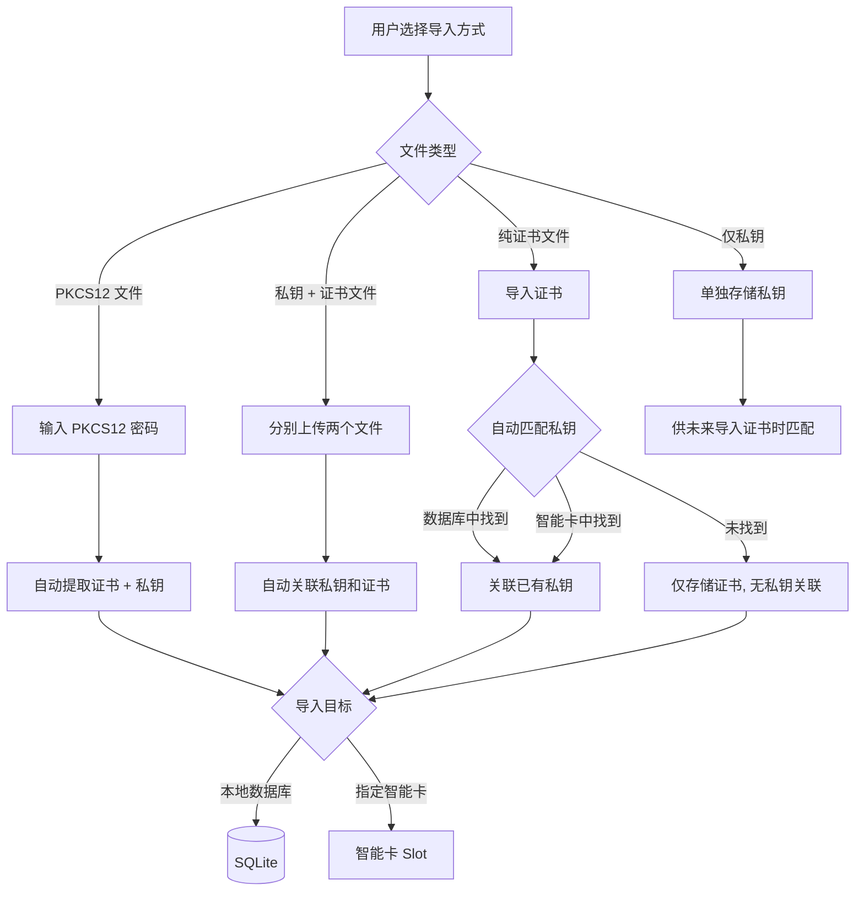
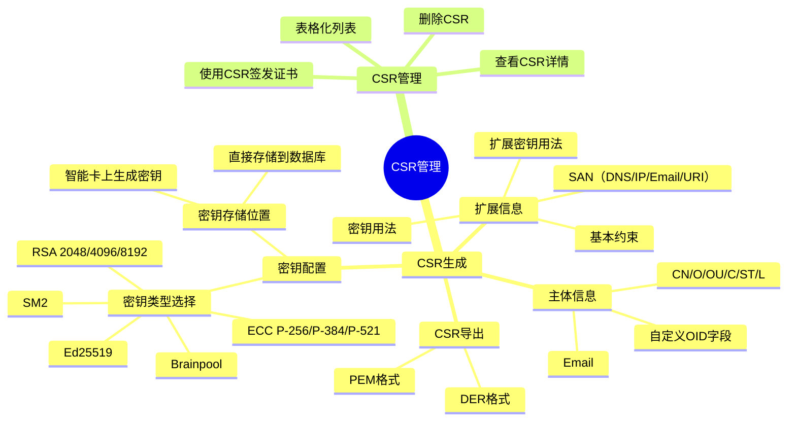
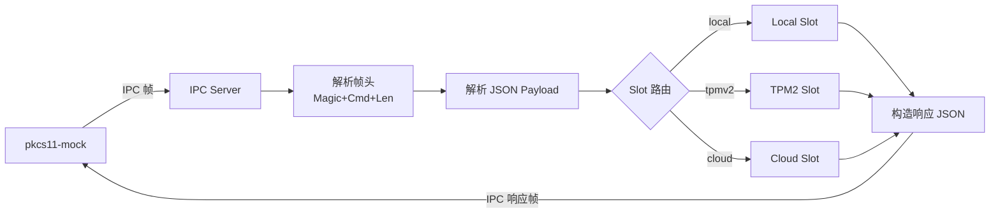

# OpenCert Manager — 本地管理端功能设计（client-card）

> 文档版本：v2.0.0
> 最后更新：2026-04-17

---

## 一、本地管理端功能全景



---

## 二、用户管理

### 2.1 用户类型

| 类型 | 密码存储 | 认证方式 | 说明 |
|------|---------|---------|------|
| 本地用户 (local) | bcrypt 哈希存储 | 本地密码验证 | 纯本地使用 |
| 云端用户 (cloud) | 留空 | 云端 API 实时认证 | 登录后返回 JWT |

### 2.2 用户数据结构

| 字段 | 类型 | 说明 |
|------|------|------|
| user_uuid | UUID | 全局唯一标识 |
| user_type | string | `local` / `cloud` |
| display_name | string | 显示名称 |
| email | string | 用户邮箱 |
| enabled | bool | 是否启用 |
| password_hash | string | 本地：bcrypt 哈希；云端：留空 |
| cloud_url | string | 云端账号的 API URL 地址 |
| auth_key | blob | 云端：JWT Token；本地：HMAC(PIN, salt) AES256 加密的用户密码 |

### 2.3 PIN 码机制

本地用户可设置 PIN 码，用于快速解锁：

```
PIN 码设置流程：
1. 生成 32 字节随机 salt
2. 计算 HMAC(PIN, salt) 作为 AES-256 密钥
3. 用该密钥加密用户密码
4. 存储加密后的密码和 salt 到 auth_key 字段

PIN 码验证流程：
1. 用户输入 PIN
2. 计算 HMAC(PIN, salt) 作为 AES-256 密钥
3. 解密 auth_key 得到用户密码
4. 用用户密码解锁卡片
```

---

## 三、智能卡管理

### 3.1 卡片数据结构

| 字段 | 类型 | 说明 |
|------|------|------|
| card_uuid | UUID | 全局唯一标识 |
| slot_type | string | `local` / `tpmv2` / `cloud` |
| card_name | string | 卡片显示名称 |
| user_uuid | UUID | 所属用户 |
| card_keys | JSON | 卡片密码加密信息列表 |
| created_at | timestamp | 创建日期 |
| expires_at | timestamp | 有效期 |
| remarks | string | 备注信息 |

### 3.2 卡片密码（card_keys）

卡片密码以 JSON 列表形式存储，支持多种解锁方式：

```json
{
  "keys": [
    {
      "type": "user",
      "user_uuid": "xxx",
      "salt": "<32字节随机值Base64>",
      "encrypted_master": "<AES256加密的主密钥Base64>"
    },
    {
      "type": "card_pin",
      "salt": "<32字节随机值Base64>",
      "encrypted_master": "<AES256加密的主密钥Base64>"
    }
  ]
}
```

- **用户密码解锁**：`HMAC(用户密码, salt)` 作为 AES-256 密钥解密主密钥
- **卡片 PIN 解锁**：`HMAC(卡片PIN, salt)` 作为 AES-256 密钥解密主密钥
- 多个用户权限则有多个 `type: "user"` 记录
- 持有卡片 PIN 可无视用户权限访问此卡

### 3.3 三种 Slot 实现

#### Local Slot（本地智能卡）



#### TPM2 Slot（TPM 智能卡）



#### Cloud Slot（云端智能卡）

**工作流：**



**缓存策略：**



**特点**：私钥不离开服务器 / 需要网络连接 / 支持跨设备使用 / 不缓存私钥和机密信息

---

## 四、证书管理

### 4.1 证书数据结构

| 字段 | 类型 | 说明 |
|------|------|------|
| cert_uuid | UUID | 全局唯一标识 |
| slot_type | string | `local` / `tpmv2` / `cloud` |
| card_uuid | UUID | 所属卡片 |
| cert_type | string | 证书类型（见下表） |
| key_type | string | 密钥类型信息 |
| cert_content | blob | 公开部分（证书/公钥） |
| temp_key_salt | blob | 临时密钥的 salt |
| temp_key_enc | blob | 加密后的临时密钥 |
| private_data | blob | 加密后的私密数据 |
| remarks | string | 备注信息 |

### 4.2 证书类型

| 类型 | cert_type | key_type 含义 | cert_content | private_data |
|------|-----------|-------------|-------------|-------------|
| X509 证书 | `x509` | 私钥类型（RSA2048等） | X509 证书 PEM | 私钥 DER |
| SSH 密钥 | `ssh` | 密钥类型（ed25519等） | SSH 公钥 | SSH 私钥 |
| GPG 证书 | `gpg` | 密钥类型 | GPG 公钥 | GPG 私钥 |
| TOTP 认证 | `totp` | 密钥长度等参数 | TOTP URI/标签 | TOTP 密钥 |
| FIDO 认证 | `fido` | 认证器类型 | FIDO 公钥 | FIDO 凭据 |
| 登录信息 | `login` | — | 网站/用户名 | 密码 |
| 密钥文本 | `secret` | — | 标签/描述 | 密钥内容 |
| 安全笔记 | `note` | — | 标题 | 笔记内容 |
| 支付信息 | `payment` | — | 卡号后四位/标签 | 完整支付信息 |

### 4.3 证书导入流程



### 4.4 私钥匹配逻辑

导入纯证书文件时，自动匹配已有私钥的流程：

1. 从证书中提取公钥信息（算法、公钥参数）
2. 遍历数据库中所有无证书关联的私钥
3. 遍历所有智能卡中的私钥
4. 比对公钥指纹（SHA-256 哈希）
5. 匹配成功则自动关联

---

## 五、PKI 工具

### 5.1 CSR 生成与管理



### 5.2 本地 CA 管理

| 功能 | 说明 |
|------|------|
| 导入 CA | 导入 CA 证书和私钥（PEM/PKCS12） |
| 表格管理 | 列表展示所有本地 CA |
| CA 详情 | 查看 CA 证书信息 |
| 删除 CA | 删除本地 CA |
| 使用 CA 签发 | 选择 CA 对 CSR 进行签发 |

### 5.3 证书签发

| 步骤 | 说明 |
|------|------|
| 1. 选择 CSR | 从 CSR 列表中选择待签发的 CSR |
| 2. 选择 CA | 选择用于签发的本地 CA |
| 3. 配置有效期 | 设置证书有效期 |
| 4. 配置扩展 | 设置密钥用法、扩展用法等 |
| 5. 签发 | 生成证书并存储 |
| 6. 管理 | 查看、导出、导入到智能卡 |

### 5.4 自签名证书

快速生成自签名证书，用于测试或内部使用：

- 一键生成密钥对 + 自签名证书
- 支持配置所有主体和扩展信息
- 可选择存储到数据库或智能卡

---

## 六、TOTP 管理

| 功能 | 说明 |
|------|------|
| 添加 TOTP | 扫描二维码或手动输入密钥 |
| 查看验证码 | 实时显示当前 TOTP 验证码和倒计时 |
| HOTP 支持 | 支持基于计数器的 HOTP |
| 导入/导出 | 支持标准 TOTP URI 格式 |
| 加密存储 | TOTP 密钥作为证书类型存储在智能卡中，受同等加密保护 |

---

## 七、云端功能

### 7.1 云端证书下发

当云端证书的存储策略支持下发时：

| 下发目标 | 说明 |
|---------|------|
| 下发到本地数据库 | 证书和私钥下载到本地 SQLite |
| 下发到本地智能卡 | 证书和私钥导入到 Local/TPM2 Slot |

### 7.2 卡片/证书同步

| 功能 | 说明 |
|------|------|
| 自动同步 | 定时从云端拉取最新卡片和证书信息 |
| 手动刷新 | 用户手动触发同步 |
| 增量同步 | 仅同步变更部分，减少网络开销 |
| 注册到系统 | 同步后通过 pkcs11-mock 注册到操作系统 |

---

## 八、IPC 服务

client-card 作为 IPC 服务端，接收 pkcs11-mock 的命令请求：

### 8.1 支持的 PKCS#11 命令

| 类别 | 命令 |
|------|------|
| 库信息 | C_GetInfo, C_GetSlotList, C_GetSlotInfo, C_GetTokenInfo |
| 机制 | C_GetMechanismList, C_GetMechanismInfo |
| 会话 | C_OpenSession, C_CloseSession, C_CloseAllSessions, C_GetSessionInfo |
| 认证 | C_Login, C_Logout, C_InitPIN, C_SetPIN |
| 对象 | C_FindObjectsInit, C_FindObjects, C_FindObjectsFinal |
| 属性 | C_GetAttributeValue, C_CreateObject, C_DestroyObject |
| 签名 | C_SignInit, C_Sign |
| 解密 | C_DecryptInit, C_Decrypt |
| 加密 | C_EncryptInit, C_Encrypt |
| 密钥生成 | C_GenerateKeyPair |

### 8.2 命令处理流程



---

## 九、REST API 服务

### 端口：1026（可配置）

| 方法 | 路径 | 功能 |
|------|------|------|
| GET | `/api/health` | 健康检查 |
| GET/POST | `/api/users` | 用户列表/创建 |
| GET/PUT/DELETE | `/api/users/{uuid}` | 用户详情/更新/删除 |
| GET/POST | `/api/cards` | 卡片列表/创建 |
| GET/PUT/DELETE | `/api/cards/{uuid}` | 卡片详情/更新/删除 |
| GET/POST | `/api/cards/{uuid}/certs` | 证书列表/导入 |
| GET/DELETE | `/api/cards/{uuid}/certs/{uuid}` | 证书详情/删除 |
| POST | `/api/cards/{uuid}/keygen` | 生成密钥对 |
| GET | `/api/logs` | 日志查询（分页） |
| GET | `/api/slots` | Slot 状态列表 |

### 认证方式

启动时生成随机 Bearer Token，写入 0600 权限文件，前端和 Electron 读取此 Token 进行认证。

---

## 十、日志管理

| 字段 | 说明 |
|------|------|
| log_uuid | 日志唯一标识 |
| log_type | 日志类型（操作/安全/系统） |
| slot_type | 关联的 Slot 类型 |
| card_uuid | 关联的卡片 |
| user_uuid | 关联的用户 |
| level | 日志等级（info/warn/error） |
| title | 日志标题 |
| content | 日志详细内容 |
| created_at | 记录时间 |

日志采用链式哈希保护完整性，每条日志包含前一条的 SHA-256 哈希。
