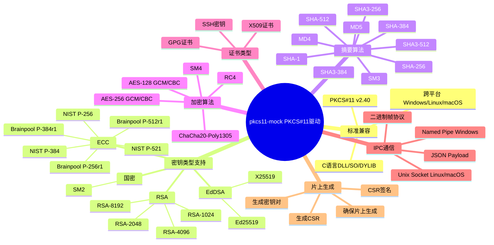
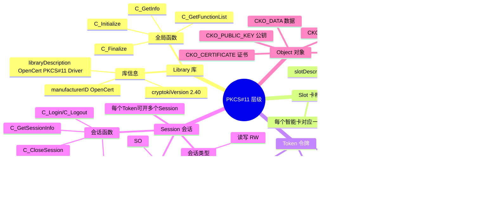

# OpenCert Manager — PKCS#11 驱动设计（pkcs11-mock）

> 文档版本：v2.0.0
> 最后更新：2026-04-17

---

## 一、驱动功能全景



---

## 二、PKCS#11 层级关系



---

## 三、PKCS#11 函数映射

### 3.1 完整函数列表

| PKCS#11 函数 | IPC 命令 | 说明 |
|-------------|---------|------|
| `C_Initialize` | Handshake (0x00FF) | 初始化库，版本协商 |
| `C_Finalize` | — | 关闭 IPC 连接 |
| `C_GetInfo` | CmdGetInfo | 获取库信息 |
| `C_GetSlotList` | CmdGetSlotList | 列出所有卡槽 |
| `C_GetSlotInfo` | CmdGetSlotInfo | 获取卡槽信息 |
| `C_GetTokenInfo` | CmdGetTokenInfo | 获取令牌信息 |
| `C_GetMechanismList` | CmdGetMechanismList | 列出支持的算法 |
| `C_GetMechanismInfo` | CmdGetMechanismInfo | 获取算法详情 |
| `C_OpenSession` | CmdOpenSession | 打开会话 |
| `C_CloseSession` | CmdCloseSession | 关闭会话 |
| `C_CloseAllSessions` | CmdCloseAllSessions | 关闭所有会话 |
| `C_GetSessionInfo` | CmdGetSessionInfo | 获取会话信息 |
| `C_Login` | CmdLogin | 登录（USER/SO） |
| `C_Logout` | CmdLogout | 登出 |
| `C_InitPIN` | CmdInitPIN | 初始化 PIN（SO 权限） |
| `C_SetPIN` | CmdSetPIN | 修改 PIN（USER 权限） |
| `C_FindObjectsInit` | CmdFindObjectsInit | 开始查找对象 |
| `C_FindObjects` | CmdFindObjects | 查找对象 |
| `C_FindObjectsFinal` | CmdFindObjectsFinal | 结束查找 |
| `C_GetAttributeValue` | CmdGetAttributeValue | 获取对象属性 |
| `C_CreateObject` | CmdCreateObject | 创建对象 |
| `C_DestroyObject` | CmdDestroyObject | 删除对象 |
| `C_SignInit` | CmdSignInit | 初始化签名 |
| `C_Sign` | CmdSign | 执行签名 |
| `C_DecryptInit` | CmdDecryptInit | 初始化解密 |
| `C_Decrypt` | CmdDecrypt | 执行解密 |
| `C_EncryptInit` | CmdEncryptInit | 初始化加密 |
| `C_Encrypt` | CmdEncrypt | 执行加密 |
| `C_GenerateKeyPair` | CmdGenerateKeyPair | 生成密钥对 |

### 3.2 未实现函数（返回 CKR_FUNCTION_NOT_SUPPORTED）

- `C_DigestInit` / `C_Digest` / `C_DigestUpdate` / `C_DigestFinal`
- `C_SignUpdate` / `C_SignFinal`
- `C_VerifyInit` / `C_Verify` / `C_VerifyUpdate` / `C_VerifyFinal`
- `C_EncryptUpdate` / `C_EncryptFinal`
- `C_DecryptUpdate` / `C_DecryptFinal`
- `C_WrapKey` / `C_UnwrapKey` / `C_DeriveKey`
- `C_GenerateKey`
- `C_SeedRandom` / `C_GenerateRandom`
- `C_WaitForSlotEvent`

---

## 四、支持的机制（Mechanism）列表

### 4.1 RSA 机制

| 机制 | 用途 | 最小密钥位 | 最大密钥位 |
|------|------|-----------|-----------|
| CKM_RSA_PKCS_KEY_PAIR_GEN | 生成 RSA 密钥对 | 1024 | 8192 |
| CKM_RSA_PKCS | 加密/解密/签名/验签 | 1024 | 8192 |
| CKM_SHA1_RSA_PKCS | SHA1+RSA 签名/验签 | 1024 | 8192 |
| CKM_SHA256_RSA_PKCS | SHA256+RSA 签名/验签 | 1024 | 8192 |
| CKM_SHA384_RSA_PKCS | SHA384+RSA 签名/验签 | 1024 | 8192 |
| CKM_SHA512_RSA_PKCS | SHA512+RSA 签名/验签 | 1024 | 8192 |
| CKM_RSA_PKCS_PSS | RSA-PSS 签名/验签 | 2048 | 8192 |
| CKM_SHA256_RSA_PKCS_PSS | SHA256+RSA-PSS | 2048 | 8192 |
| CKM_SHA384_RSA_PKCS_PSS | SHA384+RSA-PSS | 2048 | 8192 |
| CKM_SHA512_RSA_PKCS_PSS | SHA512+RSA-PSS | 2048 | 8192 |
| CKM_RSA_PKCS_OAEP | RSA-OAEP 加密/解密 | 1024 | 8192 |

### 4.2 ECC 机制

| 机制 | 用途 | 说明 |
|------|------|------|
| CKM_EC_KEY_PAIR_GEN | 生成 EC 密钥对 | P-256/384/521, Brainpool |
| CKM_ECDSA | ECDSA 签名/验签 | 原始摘要 |
| CKM_ECDSA_SHA256 | SHA256+ECDSA | — |
| CKM_ECDSA_SHA384 | SHA384+ECDSA | — |
| CKM_ECDSA_SHA512 | SHA512+ECDSA | — |

### 4.3 EdDSA 机制

| 机制 | 用途 | 说明 |
|------|------|------|
| CKM_EDDSA | Ed25519 签名 | 纯签名模式 |

### 4.4 对称加密机制

| 机制 | 用途 | 密钥位 |
|------|------|--------|
| CKM_AES_KEY_GEN | 生成 AES 密钥 | 128/256 |
| CKM_AES_CBC | AES-CBC 加密/解密 | 128/256 |
| CKM_AES_GCM | AES-GCM 加密/解密 | 128/256 |
| CKM_CHACHA20_POLY1305 | ChaCha20 加密/解密 | 256 |

### 4.5 摘要机制

| 机制 | 输出长度 |
|------|---------|
| CKM_SHA_1 | 20 字节 |
| CKM_SHA256 | 32 字节 |
| CKM_SHA384 | 48 字节 |
| CKM_SHA512 | 64 字节 |
| CKM_SHA3_256 | 32 字节 |
| CKM_SHA3_384 | 48 字节 |
| CKM_SHA3_512 | 64 字节 |
| CKM_MD5 | 16 字节 |
| CKM_SM3 | 32 字节 |

### 4.6 国密机制

| 机制 | 用途 | 说明 |
|------|------|------|
| CKM_SM2_KEY_PAIR_GEN | 生成 SM2 密钥对 | — |
| CKM_SM2 | SM2 签名/加密 | — |
| CKM_SM4_KEY_GEN | 生成 SM4 密钥 | 128 位 |
| CKM_SM4_CBC | SM4-CBC 加密/解密 | 128 位 |

---

## 五、IPC 客户端实现

### 5.1 连接管理

```
C_Initialize 调用时：
1. 尝试连接 IPC 通道（Named Pipe / Unix Socket）
2. 发送 Handshake 帧，协商协议版本
3. 连接成功后启动心跳线程（30 秒间隔）
4. 连接失败时返回 CKR_DEVICE_ERROR

C_Finalize 调用时：
1. 停止心跳线程
2. 关闭 IPC 连接
3. 释放所有资源
```

### 5.2 重连机制

```
心跳超时（3 次无响应）或连接断开时：
1. 标记连接为断开状态
2. 后续 PKCS#11 调用返回 CKR_DEVICE_ERROR
3. 下次 C_Initialize 时重新建立连接

client-card 未启动时：
1. C_Initialize 尝试连接，超时后返回 CKR_DEVICE_ERROR
2. 应用程序可稍后重试
```

### 5.3 线程安全

- 所有 IPC 通信使用互斥锁保护
- 支持多线程并发调用 PKCS#11 函数
- 会话句柄和对象句柄的分配使用原子操作

---

## 六、片上生成密钥

### 6.1 流程

```
1. 应用调用 C_GenerateKeyPair
2. pkcs11-mock 发送 CmdGenerateKeyPair 到 client-card
3. client-card 在指定 Slot 上生成密钥对：
   - Local Slot：软件生成，加密存储
   - TPM2 Slot：TPM 芯片内生成（高安全性）或软件生成+TPM加密（中/低安全性）
   - Cloud Slot：云端服务器生成
4. 返回公钥和私钥的对象句柄
```

### 6.2 CSR 生成

```
1. 生成密钥对（片上生成）
2. 构造 CSR 请求（主体信息 + 扩展信息）
3. 使用私钥对 CSR 签名（确保是片上生成的密钥签名）
4. 返回 CSR（PEM/DER 格式）
```

---

## 七、对象属性映射

### 7.1 证书对象（CKO_CERTIFICATE）

| 属性 | 说明 |
|------|------|
| CKA_CLASS | CKO_CERTIFICATE |
| CKA_CERTIFICATE_TYPE | CKC_X_509 |
| CKA_SUBJECT | 证书主体 DER |
| CKA_ISSUER | 颁发者 DER |
| CKA_SERIAL_NUMBER | 序列号 |
| CKA_VALUE | 证书 DER 编码 |
| CKA_ID | 密钥标识（与对应私钥/公钥匹配） |
| CKA_LABEL | 显示名称 |

### 7.2 公钥对象（CKO_PUBLIC_KEY）

| 属性 | 说明 |
|------|------|
| CKA_CLASS | CKO_PUBLIC_KEY |
| CKA_KEY_TYPE | CKK_RSA / CKK_EC / CKK_EDDSA |
| CKA_ID | 密钥标识 |
| CKA_MODULUS | RSA 模数 |
| CKA_PUBLIC_EXPONENT | RSA 公钥指数 |
| CKA_EC_PARAMS | EC 曲线参数 OID |
| CKA_EC_POINT | EC 公钥点 |

### 7.3 私钥对象（CKO_PRIVATE_KEY）

| 属性 | 说明 |
|------|------|
| CKA_CLASS | CKO_PRIVATE_KEY |
| CKA_KEY_TYPE | CKK_RSA / CKK_EC / CKK_EDDSA |
| CKA_ID | 密钥标识 |
| CKA_SIGN | 是否可签名 |
| CKA_DECRYPT | 是否可解密 |
| CKA_SENSITIVE | 是否敏感（始终为 TRUE） |
| CKA_EXTRACTABLE | 是否可导出（始终为 FALSE） |
| CKA_ALWAYS_AUTHENTICATE | 每次操作是否需要认证 |

---

## 八、构建与平台支持

### 8.1 构建产物

| 平台 | 产物 | 编译器 |
|------|------|--------|
| Windows x64 | `pkcs11-mock.dll` | MSVC / MinGW |
| Linux x64 | `libpkcs11-mock.so` | GCC |
| macOS arm64/x64 | `libpkcs11-mock.dylib` | Clang |

### 8.2 CMake 构建

```cmake
cmake_minimum_required(VERSION 3.20)
project(pkcs11-mock C)

set(CMAKE_C_STANDARD 11)

add_library(pkcs11-mock SHARED
    src/pkcs11_mock.c
    src/ipc_client.c
    src/frame.c
)

target_include_directories(pkcs11-mock PRIVATE include/)

if(WIN32)
    target_link_libraries(pkcs11-mock PRIVATE ws2_32)
endif()
```
