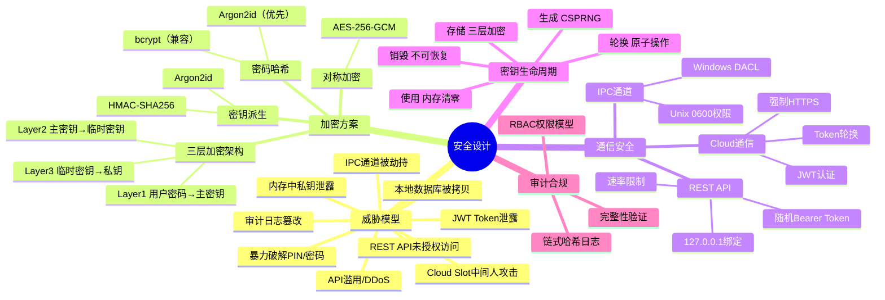

# OpenCert Manager — 安全设计文档

> 文档版本：v2.0.0
> 最后更新：2026-04-17

---

## 一、安全架构总览



---

## 二、威胁模型

### 2.1 资产清单

| 资产 | 存储位置 | 敏感等级 |
|------|---------|---------|
| 用户私钥（X509/SSH/GPG） | 本地 SQLite / TPM / 云端 | **极高** |
| TOTP 密钥 | 本地 SQLite / 云端 | **高** |
| 登录信息/安全笔记/支付信息 | 本地 SQLite / 云端 | **高** |
| 卡片主密钥 | 本地 SQLite（加密） | **极高** |
| 用户密码哈希 | 本地 SQLite / 云端 PostgreSQL | **高** |
| JWT Token | 内存 / 本地文件 | **中** |
| 审计日志 | 本地 SQLite | **中** |

### 2.2 威胁场景与缓解

| 威胁 | 攻击面 | 缓解措施 |
|------|-------|---------|
| 本地数据库被拷贝 | 物理访问 | SQLCipher 全库加密，密钥由 TPM 封装或用户主密码派生 |
| IPC 通道被劫持 | 本地恶意进程 | Windows DACL / Unix 0600 权限隔离 |
| REST API 未授权访问 | 本地恶意进程 | 启动时生成随机 Bearer Token，写入 0600 权限文件 |
| Cloud Slot 中间人攻击 | 网络 | 强制 HTTPS，验证 TLS 证书，不跳过证书验证 |
| 暴力破解 PIN/密码 | 网络/本地 | 5 次失败锁定 15 分钟，Argon2id 密钥派生 |
| API 滥用/DDoS | 网络 | 令牌桶速率限制（100 req/min/IP） |
| JWT Token 泄露 | 网络 | Token 轮换，登出黑名单，短有效期（15 分钟） |
| 审计日志篡改 | 物理/内部 | 链式哈希完整性保护 |
| 内存中私钥泄露 | 内存转储 | 使用后立即清零（`for range` 清零字节切片） |

---

## 三、加密方案详细说明

### 3.1 三层加密架构（Local/TPM2 Slot）

```
Layer 1: 用户密码 → Argon2id(password, salt, time=3, mem=64MB, threads=4) → 派生密钥
         派生密钥 → AES-256-GCM 加密 → 卡片主密钥（32字节随机）

Layer 2: 卡片主密钥 → HMAC-SHA256(masterKey, salt) → 临时密钥加密密钥
         临时密钥加密密钥 → AES-256-GCM 加密 → 临时密钥（32字节随机，每证书独立）

Layer 3: 临时密钥 → AES-256-GCM(nonce, plaintext, AAD=card_uuid+cert_uuid) → 私钥密文
```

**设计要点**：
- 每个证书拥有独立的临时密钥，单个证书泄露不影响其他证书
- AAD 绑定 card_uuid 和 cert_uuid，防止密文跨上下文替换攻击
- 卡片主密钥支持多用户共享（多个 Layer 1 加密记录）

### 3.2 TPM2 增强加密

#### 高安全性模式

```
TPM 内部生成 RSA/EC 密钥对 → 不可导出
所有密钥操作（签名/解密）由 TPM 硬件完成
私钥永不离开 TPM 安全边界
不可恢复，不可备份
```

#### 中安全性模式

```
用户密码
    │
    ▼ Argon2id(password, salt) → AES-256-GCM
卡片主密钥 (32字节)
    │
    ├──▼ TPM 片上生成加密密钥 → 加密主密钥（本地保护）
    │
    └──▼ 用户云端公钥 → 加密主密钥副本（支持云端恢复）
    │
    ▼ HMAC(masterKey, salt) → AES-256-GCM
临时密钥
    │
    ▼ AES-256-GCM
私钥 DER 数据
```

#### 低安全性模式

```
用户密码
    │
    ▼ Argon2id(password, salt) → AES-256-GCM
卡片主密钥 (32字节)
    │
    └──▼ 用户云端公钥 → 加密主密钥副本（支持云端恢复）
    │
    ▼ HMAC(masterKey, salt) → AES-256-GCM
临时密钥
    │
    ▼ AES-256-GCM
私钥 DER 数据
```

### 3.3 AES-256-GCM 参数

| 参数 | 值 | 说明 |
|------|-----|------|
| Nonce | 12 字节 | `crypto/rand` 生成，每次加密唯一 |
| AAD | card_uuid + cert_uuid | 防止密文跨上下文替换 |
| Tag | 16 字节 | GCM 默认认证标签长度 |
| 密钥 | 32 字节 | AES-256 |

### 3.4 密码哈希

| 算法 | 参数 | 用途 |
|------|------|------|
| Argon2id（优先） | time=3, memory=64MB, threads=4, keyLen=32 | 新用户密码哈希 |
| bcrypt（兼容） | cost ≥ 13 | 旧用户兼容 |

**自动迁移**：登录时检测旧 bcrypt 哈希，验证成功后自动升级为 Argon2id。

---

## 四、密钥生命周期管理

| 阶段 | 操作 | 安全要求 |
|------|------|---------|
| 生成 | `crypto/rand` 生成随机字节 | CSPRNG，不可预测 |
| 存储 | 三层加密后写入 SQLite | 明文密钥不持久化 |
| 使用 | 解密到内存，操作完成后清零 | 最小化明文暴露时间 |
| 轮换 | 修改密码时重新加密所有密钥 | 原子操作，事务保护 |
| 销毁 | 删除证书时清除所有加密数据 | 不可恢复 |

### 密钥存储类型安全约束

| 安全等级 | 密钥位置 | 可导出 | 可备份 | 可重新导入 |
|---------|---------|--------|--------|-----------|
| 高安全性 | TPM 内部 | ❌ | ❌ | ❌ |
| 中安全性 | 本地 DB + TPM 加密 | ❌ | ✅（云端公钥加密） | ✅（需云端恢复） |
| 低安全性 | 本地 DB + 密码加密 | ❌ | ✅（云端公钥加密） | ✅（需云端恢复） |
| 文件下载 | 用户本地 | ✅ | ✅（自动） | N/A |

---

## 五、通信安全

### 5.1 IPC 通道安全

| 平台 | 安全措施 |
|------|---------|
| Windows | Named Pipe + DACL（仅当前用户 + SYSTEM 可访问） |
| Linux/macOS | Unix Domain Socket + 文件权限 0600（仅所有者可访问） |

协议安全：
- 二进制帧头（Magic + Cmd + Len）+ JSON Payload
- 心跳机制：30 秒空闲发送 Ping，3 次无响应重连
- 版本协商：C_Initialize 阶段交换协议版本号

### 5.2 REST API 安全（本地 client-card）

| 措施 | 说明 |
|------|------|
| Bearer Token | 启动时生成随机 Token，写入 0600 权限文件 |
| 绑定地址 | 默认 127.0.0.1，非本地绑定输出安全警告 |
| 速率限制 | 100 请求/分钟/IP |
| CORS | 仅允许 localhost 来源 |
| 输入验证 | 所有 API 参数严格校验 |

### 5.3 Cloud Slot 通信安全

| 措施 | 说明 |
|------|------|
| 传输加密 | 强制 HTTPS（生产环境） |
| 认证 | JWT Bearer Token |
| Token 管理 | Access Token 15 分钟有效期，Refresh Token 7 天 |
| Token 轮换 | 自动 refresh，登出黑名单 |
| 证书验证 | 不跳过 TLS 证书验证（开发环境可配置） |

### 5.4 云端平台 API 安全

| 措施 | 说明 |
|------|------|
| JWT 算法 | ES256（优先）/ RS256 / HS256 |
| 密钥长度 | ≥ 256 位 |
| 登录保护 | 5 次失败锁定 15 分钟 |
| 速率限制 | 100 请求/分钟/IP |
| TLS | 强制启用，建议 Let's Encrypt 或内部 CA |
| 数据库连接 | PostgreSQL 启用 SSL |

---

## 六、PIN/PUK/Admin Key 安全设计

### 6.1 加密存储（非仅验证）

PIN、PUK、Admin Key 均采用**加密存储**而非简单的哈希验证：

```
PIN 码加密存储：
1. 生成 32 字节随机 salt
2. Argon2id(PIN, salt) → 派生密钥
3. 派生密钥 → AES-256-GCM 加密卡片主密钥
4. 存储 salt + 加密后的主密钥

验证时：
1. Argon2id(输入PIN, salt) → 派生密钥
2. 尝试 AES-256-GCM 解密
3. 解密成功 = PIN 正确（GCM 认证标签验证）
```

### 6.2 权限层级

```
Admin Key（最高权限）
  ├── 可重置 PUK 码（重新加密主密钥）
  ├── 可重置 PIN 码（重新加密主密钥）
  └── 可执行所有管理操作

PUK 码（恢复权限）
  ├── 可重置 PIN 码（重新加密主密钥）
  └── PIN 错误次数超限后使用

PIN 码（日常使用）
  ├── 导入/删除证书
  ├── 签名/解密操作
  └── 查看私密信息
```

### 6.3 错误次数限制

| 凭据 | 最大错误次数 | 锁定后操作 |
|------|------------|-----------|
| PIN | 5 次 | 需要 PUK 解锁 |
| PUK | 10 次 | 需要 Admin Key 解锁 |
| Admin Key | 无限制 | 但有速率限制 |

---

## 七、审计与合规

### 7.1 审计日志

- **链式哈希**：每条日志包含前一条的 SHA-256 哈希
- **完整性验证**：读取时自动验证哈希链，断链标记 `integrity_broken`
- **不可篡改**：直接修改数据库记录会被检测到

```
日志记录格式：
{
  "uuid": "...",
  "prev_hash": "SHA256(前一条日志)",
  "log_type": "security",
  "level": "warn",
  "title": "登录失败",
  "content": "用户 xxx 密码错误，第 3 次尝试",
  "created_at": "2026-04-17T12:00:00Z"
}
```

### 7.2 审计事件

| 事件类型 | 记录内容 |
|---------|---------|
| 用户登录/登出 | 用户 ID、时间、IP、成功/失败 |
| 密码修改 | 用户 ID、时间 |
| 卡片操作 | 创建/删除/解锁卡片 |
| 证书操作 | 导入/导出/删除/签名/解密 |
| PIN 操作 | PIN 验证失败、PIN 重置 |
| 系统事件 | 服务启动/停止、配置变更 |

---

## 八、安全加固清单

### 8.1 本地管理端（client-card）

- [ ] API 绑定地址为 127.0.0.1
- [ ] Bearer Token 文件权限 0600
- [ ] SQLite 数据库文件权限 0600
- [ ] IPC 通道权限正确设置
- [ ] 审计日志已启用
- [ ] TPM 可用性已确认（如需高安全性模式）
- [ ] 内存中私钥使用后清零

### 8.2 云端平台（server-card）

- [ ] TLS 证书有效且自动续期
- [ ] 数据库连接使用 SSL
- [ ] JWT 密钥长度 ≥ 256 位
- [ ] 支付插件配置参数已加密存储
- [ ] 审计日志已启用
- [ ] 定期验证审计日志完整性
- [ ] 配置反向代理（Nginx/Caddy）
- [ ] 防火墙规则已配置
- [ ] 定期备份数据库
