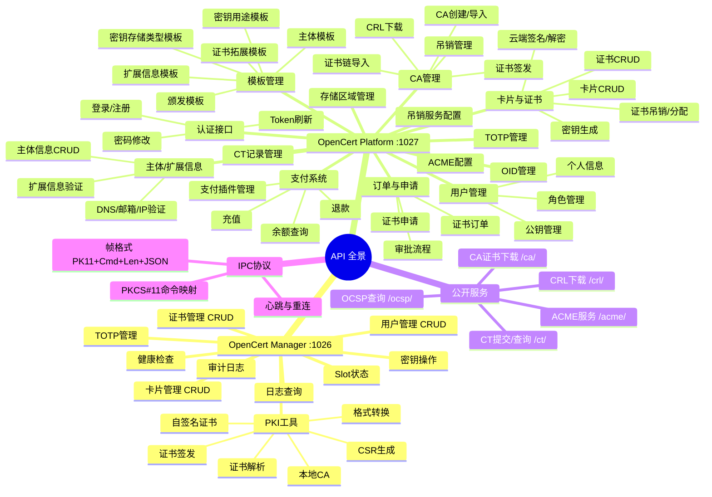

# OpenCert Manager — 完整 API 规范

> 文档版本：v2.0.0
> 最后更新：2026-04-17

---

## 一、API 全景



---

## 二、OpenCert Manager API（端口 :1026）

### 通用说明

- **基础路径**: `http://127.0.0.1:1026/api`
- **认证方式**: `Authorization: Bearer <token>`（启动时自动生成）
- **响应格式**: JSON
- **成功响应**: `{ "data": ... }`
- **错误响应**: `{ "error": "错误描述" }`

---

### 2.1 健康检查

```
GET /api/health
```

**响应 200**:
```json
{ "data": { "status": "ok", "version": "1.0.0", "time": "1713100000" } }
```

### 2.2 用户管理

| 方法 | 路径 | 说明 |
|------|------|------|
| GET | `/api/users` | 用户列表 |
| POST | `/api/users` | 创建用户 |
| GET | `/api/users/{uuid}` | 用户详情 |
| PUT | `/api/users/{uuid}` | 更新用户 |
| DELETE | `/api/users/{uuid}` | 删除用户 |

**POST /api/users 请求体**:
```json
{
  "user_type": "local",
  "display_name": "张三",
  "email": "zhangsan@example.com",
  "password": "secure_password",
  "role": "user"
}
```

### 2.3 卡片管理

| 方法 | 路径 | 说明 |
|------|------|------|
| GET | `/api/cards` | 卡片列表 |
| POST | `/api/cards` | 创建卡片 |
| GET | `/api/cards/{uuid}` | 卡片详情 |
| PUT | `/api/cards/{uuid}` | 更新卡片 |
| DELETE | `/api/cards/{uuid}` | 删除卡片 |

**POST /api/cards 请求体**:
```json
{
  "slot_type": "local",
  "card_name": "我的智能卡",
  "user_uuid": "user-uuid-here",
  "password": "card_password"
}
```

### 2.4 证书管理

| 方法 | 路径 | 说明 |
|------|------|------|
| GET | `/api/cards/{card_uuid}/certs` | 证书列表 |
| POST | `/api/cards/{card_uuid}/certs` | 导入证书 |
| GET | `/api/cards/{card_uuid}/certs/{uuid}` | 证书详情 |
| DELETE | `/api/cards/{card_uuid}/certs/{uuid}` | 删除证书 |

### 2.5 密钥操作

```
POST /api/cards/{card_uuid}/keygen
```

**请求体**:
```json
{
  "key_type": "ec256",
  "password": "card_password"
}
```

### 2.6 TOTP 管理

| 方法 | 路径 | 说明 |
|------|------|------|
| GET | `/api/cards/{card_uuid}/totp` | TOTP 条目列表 |
| POST | `/api/cards/{card_uuid}/totp` | 添加 TOTP 条目 |
| GET | `/api/totp/{id}/code` | 获取当前验证码 |
| DELETE | `/api/totp/{id}` | 删除 TOTP 条目 |

**POST 请求体**:
```json
{
  "issuer": "GitHub",
  "account": "user@example.com",
  "secret": "JBSWY3DPEHPK3PXP",
  "algorithm": "SHA1",
  "digits": 6,
  "period": 30,
  "otp_type": "totp"
}
```

**GET /api/totp/{id}/code 响应**:
```json
{ "data": { "code": "123456", "remaining": 15, "period": 30 } }
```

### 2.7 本地 PKI 工具

| 方法 | 路径 | 说明 |
|------|------|------|
| POST | `/api/pki/selfsign` | 生成自签名证书 |
| POST | `/api/pki/csr` | 生成 CSR |
| POST | `/api/pki/ca` | 创建本地 CA |
| POST | `/api/pki/ca/issue` | 使用本地 CA 签发证书 |
| POST | `/api/pki/convert` | 证书格式转换 |
| POST | `/api/pki/parse` | 解析证书文件 |

**POST /api/pki/selfsign 请求体**:
```json
{
  "card_uuid": "card-uuid",
  "password": "card_password",
  "key_type": "ec256",
  "subject": { "cn": "example.com", "o": "Example Inc", "c": "CN" },
  "validity_days": 365,
  "san": { "dns": ["example.com", "*.example.com"], "ip": ["1.2.3.4"] },
  "key_usage": ["digital_signature", "key_encipherment"],
  "ext_key_usage": ["server_auth", "client_auth"]
}
```

### 2.8 Slot 状态

```
GET /api/slots
```

**响应**:
```json
{ "data": [{ "slot_id": 0, "description": "Local Slot", "token_present": true }] }
```

### 2.9 日志与审计

| 方法 | 路径 | 说明 |
|------|------|------|
| GET | `/api/logs?offset=0&limit=20` | 日志查询（分页） |
| GET | `/api/audit?offset=0&limit=20` | 审计日志（含完整性校验） |

**审计日志响应**:
```json
{
  "data": {
    "logs": [],
    "total": 100,
    "integrity_broken": false
  }
}
```

---

## 三、OpenCert Platform API（端口 :1027）

### 通用说明

- **基础路径**: `https://platform.example.com`
- **认证方式**: `Authorization: Bearer <jwt_token>`
- **响应格式**: JSON
- **成功响应**: `{ "data": ... }` 或 `{ "items": [...], "total": N, "page": 1, "page_size": 20 }`
- **错误响应**: `{ "error": "错误描述" }`
- **权限级别**: `公开` / `需认证` / `仅 user+` / `仅 admin`

---

### 3.1 认证接口

| 方法 | 路径 | 权限 | 说明 |
|------|------|------|------|
| POST | `/api/auth/login` | 公开 | 登录，返回 JWT Token |
| POST | `/api/auth/register` | 公开 | 注册新用户 |
| POST | `/api/auth/refresh` | 需认证 | 刷新 Token |
| DELETE | `/api/auth/logout` | 需认证 | 登出（Token 加入黑名单） |
| PUT | `/api/auth/password` | 需认证 | 修改密码 |

**POST /api/auth/login**:
```json
// 请求
{ "username": "admin", "password": "secure_password" }

// 响应 200
{
  "data": {
    "token": "eyJhbGciOiJIUzI1NiIs...",
    "user_uuid": "550e8400-e29b-41d4-a716-446655440000",
    "username": "admin",
    "role": "admin",
    "expires_at": "2026-04-16T17:00:00Z"
  }
}
```

**POST /api/auth/register**:
```json
{
  "username": "newuser",
  "password": "secure_password",
  "email": "newuser@example.com",
  "display_name": "新用户"
}
```

### 3.2 用户管理接口

| 方法 | 路径 | 权限 | 说明 |
|------|------|------|------|
| GET | `/api/users/me` | 需认证 | 获取当前用户信息 |
| PUT | `/api/users/me` | 需认证 | 更新个人信息 |
| PUT | `/api/users/me/pubkey` | 需认证 | 更新云端公钥 |
| GET | `/api/users` | 仅 admin | 用户列表（分页） |
| PUT | `/api/users/{uuid}/role` | 仅 admin | 修改用户角色 |
| PUT | `/api/users/{uuid}/enabled` | 仅 admin | 启用/禁用用户 |

### 3.3 卡片与证书接口

| 方法 | 路径 | 权限 | 说明 |
|------|------|------|------|
| GET | `/api/cards` | 需认证 | 卡片列表 |
| POST | `/api/cards` | 仅 user+ | 创建卡片 |
| GET | `/api/cards/{uuid}` | 需认证 | 卡片详情 |
| DELETE | `/api/cards/{uuid}` | 仅 user+ | 删除卡片 |
| GET | `/api/cards/{uuid}/certs` | 需认证 | 证书列表 |
| POST | `/api/cards/{uuid}/certs` | 仅 user+ | 导入证书 |
| DELETE | `/api/cards/{uuid}/certs/{cert_uuid}` | 仅 user+ | 删除证书 |
| POST | `/api/cards/{uuid}/keygen` | 需认证 | 生成密钥对 |
| POST | `/api/cards/{uuid}/sign` | 需认证 | 云端签名 |
| POST | `/api/cards/{uuid}/decrypt` | 需认证 | 云端解密 |
| GET | `/api/certs` | 需认证 | 全局证书筛选查询 |
| POST | `/api/certs/{uuid}/revoke` | 仅 admin | 吊销证书 |
| POST | `/api/certs/{uuid}/assign` | 仅 admin | 分配证书到智能卡 |

**POST /api/cards/{uuid}/sign 请求体**:
```json
{
  "cert_uuid": "cert-uuid",
  "data_base64": "base64编码的待签名数据",
  "algorithm": "SHA256withECDSA"
}
```

**GET /api/certs 查询参数**: `ca_uuid`, `template_uuid`, `user_uuid`, `card_uuid`, `cert_type`, `status`, `page`, `page_size`

### 3.4 CA 管理接口

| 方法 | 路径 | 权限 | 说明 |
|------|------|------|------|
| GET | `/api/cas` | 需认证 | CA 列表 |
| POST | `/api/cas` | 仅 admin | 创建自签名 CA |
| GET | `/api/cas/{uuid}` | 需认证 | CA 详情 |
| PUT | `/api/cas/{uuid}` | 仅 admin | 更新 CA 信息 |
| DELETE | `/api/cas/{uuid}` | 仅 admin | 删除 CA |
| POST | `/api/cas/{uuid}/import-chain` | 仅 admin | 导入证书链 |
| GET | `/api/cas/{uuid}/revoked` | 需认证 | 吊销证书列表 |
| POST | `/api/cas/{uuid}/revoke` | 仅 admin | 吊销证书 |
| GET | `/api/cas/{uuid}/crl` | 公开 | 下载 CRL（DER 格式） |
| POST | `/api/cas/{uuid}/issue` | 仅 admin | 签发证书 |

**POST /api/cas 请求体**:
```json
{
  "name": "根 CA",
  "key_type": "ec384",
  "validity_years": 10,
  "subject": {
    "common_name": "OpenCert Root CA",
    "organization": "Example Corp",
    "country": "CN"
  }
}
```

**POST /api/cas/{uuid}/revoke 请求体**:
```json
{
  "serial_hex": "0a1b2c3d4e5f",
  "reason": 1
}
```

> 吊销原因码（RFC 5280）：0=unspecified, 1=keyCompromise, 2=cACompromise, 3=affiliationChanged, 4=superseded, 5=cessationOfOperation

### 3.5 模板管理接口

#### 3.5.1 证书颁发模板

| 方法 | 路径 | 权限 | 说明 |
|------|------|------|------|
| GET | `/api/templates/issuance` | 需认证 | 颁发模板列表 |
| POST | `/api/templates/issuance` | 仅 admin | 创建颁发模板 |
| GET | `/api/templates/issuance/{uuid}` | 需认证 | 颁发模板详情 |
| DELETE | `/api/templates/issuance/{uuid}` | 仅 admin | 删除颁发模板 |

**POST 请求体**:
```json
{
  "name": "标准 SSL 证书",
  "category": "ssl",
  "is_ca": false,
  "validity_options": [365, 730, 1095],
  "allowed_key_types": ["ec256", "ec384", "rsa2048"],
  "allowed_ca_uuids": ["ca-uuid-1"],
  "subject_template_uuid": "subj-tmpl-uuid",
  "extension_template_uuid": "ext-tmpl-uuid",
  "key_usage_template_uuid": "ku-tmpl-uuid",
  "key_storage_template_uuid": "ks-tmpl-uuid",
  "cert_ext_template_uuid": "ce-tmpl-uuid",
  "price_cents": 9900,
  "stock": -1,
  "enabled": true
}
```

#### 3.5.2 主体模板

| 方法 | 路径 | 权限 | 说明 |
|------|------|------|------|
| GET | `/api/templates/subject` | 需认证 | 主体模板列表 |
| POST | `/api/templates/subject` | 仅 admin | 创建主体模板 |
| DELETE | `/api/templates/subject/{uuid}` | 仅 admin | 删除主体模板 |

**POST 请求体**:
```json
{
  "name": "企业主体模板",
  "fields": [
    { "name": "common_name", "required": true, "default_value": "", "max_length": 64 },
    { "name": "organization", "required": true, "default_value": "", "max_length": 64 },
    { "name": "country", "required": false, "default_value": "CN", "max_length": 2 }
  ]
}
```

#### 3.5.3 扩展信息模板

| 方法 | 路径 | 权限 | 说明 |
|------|------|------|------|
| GET | `/api/templates/extension` | 需认证 | 扩展信息模板列表 |
| POST | `/api/templates/extension` | 仅 admin | 创建扩展信息模板 |
| DELETE | `/api/templates/extension/{uuid}` | 仅 admin | 删除扩展信息模板 |

**POST 请求体**:
```json
{
  "name": "标准 SAN 模板",
  "max_dns": 10,
  "max_email": 5,
  "max_ip": 5,
  "max_uri": 3,
  "require_verification": true
}
```

#### 3.5.4 密钥用途模板

| 方法 | 路径 | 权限 | 说明 |
|------|------|------|------|
| GET | `/api/templates/key-usage` | 需认证 | 密钥用途模板列表 |
| POST | `/api/templates/key-usage` | 仅 admin | 创建密钥用途模板 |
| DELETE | `/api/templates/key-usage/{uuid}` | 仅 admin | 删除密钥用途模板 |

**POST 请求体**:
```json
{
  "name": "TLS 服务器",
  "key_usage_bits": 160,
  "ext_key_usages": ["1.3.6.1.5.5.7.3.1", "1.3.6.1.5.5.7.3.2"]
}
```

> 密钥用法位掩码（RFC 5280）：digitalSignature=128, nonRepudiation=64, keyEncipherment=32, dataEncipherment=16, keyAgreement=8, keyCertSign=4, cRLSign=2, encipherOnly=1

#### 3.5.5 证书拓展模板

| 方法 | 路径 | 权限 | 说明 |
|------|------|------|------|
| GET | `/api/templates/cert-ext` | 需认证 | 证书拓展模板列表 |
| POST | `/api/templates/cert-ext` | 仅 admin | 创建证书拓展模板 |
| GET | `/api/templates/cert-ext/{uuid}` | 需认证 | 证书拓展模板详情 |
| DELETE | `/api/templates/cert-ext/{uuid}` | 仅 admin | 删除证书拓展模板 |

**POST 请求体**:
```json
{
  "name": "标准 PKI 拓展",
  "crl_distribution_points": ["http://crl.example.com/root.crl"],
  "ocsp_servers": ["http://ocsp.example.com"],
  "aia_issuers": ["http://ca.example.com/root.crt"],
  "ct_servers": ["https://ct.googleapis.com/logs/argon2024"],
  "ev_policy_oid": "2.23.140.1.1"
}
```

#### 3.5.6 密钥存储类型模板

| 方法 | 路径 | 权限 | 说明 |
|------|------|------|------|
| GET | `/api/templates/key-storage` | 需认证 | 密钥存储类型模板列表 |
| POST | `/api/templates/key-storage` | 仅 admin | 创建密钥存储类型模板 |
| GET | `/api/templates/key-storage/{uuid}` | 需认证 | 详情 |
| PUT | `/api/templates/key-storage/{uuid}` | 仅 admin | 更新 |
| DELETE | `/api/templates/key-storage/{uuid}` | 仅 admin | 删除 |

**POST 请求体**:
```json
{
  "name": "高安全性模板",
  "allowed_storage_types": ["virtual_card", "physical_card"],
  "virtual_card_security_level": "high",
  "allow_reimport": false,
  "cloud_backup": false,
  "allow_reissue": false,
  "max_reissue_count": 0
}
```

> `allowed_storage_types`: `file_download` / `cloud_card` / `physical_card` / `virtual_card`
> `virtual_card_security_level`: `high` / `medium` / `low`

### 3.6 订单与申请接口

| 方法 | 路径 | 权限 | 说明 |
|------|------|------|------|
| POST | `/api/cert-orders` | 仅 user+ | 创建证书订单 |
| GET | `/api/cert-orders` | 需认证 | 证书订单列表 |
| POST | `/api/cert-applications` | 仅 user+ | 提交证书申请 |
| GET | `/api/cert-applications` | 需认证 | 证书申请列表 |
| PUT | `/api/cert-applications/{uuid}/approve` | 仅 admin | 审批通过 |
| PUT | `/api/cert-applications/{uuid}/reject` | 仅 admin | 审批拒绝 |

**POST /api/cert-orders 请求体**:
```json
{
  "issuance_template_uuid": "tmpl-uuid",
  "validity_days": 365,
  "key_type": "ec256"
}
```

**POST /api/cert-applications 请求体**:
```json
{
  "cert_order_uuid": "order-uuid",
  "subject_info_uuid": "subj-info-uuid",
  "extension_info_uuids": ["ext-info-uuid-1", "ext-info-uuid-2"],
  "key_type": "ec256"
}
```

### 3.7 主体信息接口

| 方法 | 路径 | 权限 | 说明 |
|------|------|------|------|
| GET | `/api/subject-infos` | 需认证 | 主体信息列表 |
| POST | `/api/subject-infos` | 仅 user+ | 创建主体信息 |
| PUT | `/api/subject-infos/{uuid}/approve` | 仅 admin | 审核通过 |
| PUT | `/api/subject-infos/{uuid}/reject` | 仅 admin | 审核拒绝 |

### 3.8 扩展信息验证接口

| 方法 | 路径 | 权限 | 说明 |
|------|------|------|------|
| GET | `/api/extension-infos` | 需认证 | 扩展信息列表 |
| POST | `/api/extension-infos` | 仅 user+ | 创建扩展信息 |
| POST | `/api/extension-infos/{uuid}/verify-dns` | 需认证 | 触发 DNS TXT 验证 |
| POST | `/api/extension-infos/{uuid}/verify-email` | 需认证 | 提交邮箱验证码 |
| DELETE | `/api/extension-infos/{uuid}` | 仅 user+ | 删除扩展信息 |

**POST /api/extension-infos 响应**（域名，返回验证 Token）:
```json
{
  "data": {
    "uuid": "ext-info-uuid",
    "type": "domain",
    "value": "example.com",
    "verify_token": "opencert-verify=abc123xyz",
    "dns_record": "_opencert.example.com TXT opencert-verify=abc123xyz",
    "status": "pending"
  }
}
```

### 3.9 支付系统接口

| 方法 | 路径 | 权限 | 说明 |
|------|------|------|------|
| POST | `/api/payment/recharge` | 需认证 | 发起充值 |
| GET | `/api/payment/orders` | 需认证 | 充值订单列表 |
| GET | `/api/payment/balance` | 需认证 | 查询余额 |
| POST | `/api/payment/refund` | 需认证 | 申请退款 |
| POST | `/api/payment/callback/{channel}` | 公开 | 支付回调 |
| GET | `/api/payment/plugins` | 仅 admin | 支付插件列表 |
| POST | `/api/payment/plugins` | 仅 admin | 创建支付插件 |
| DELETE | `/api/payment/plugins/{uuid}` | 仅 admin | 删除支付插件 |
| PUT | `/api/payment/refund/{uuid}/approve` | 仅 admin | 审批退款 |

**GET /api/payment/balance 响应**:
```json
{
  "data": {
    "balance_cents": 50000,
    "total_recharged_cents": 100000,
    "total_consumed_cents": 50000
  }
}
```

### 3.10 其他管理接口

#### 存储区域管理

| 方法 | 路径 | 权限 | 说明 |
|------|------|------|------|
| GET | `/api/storage-zones` | 需认证 | 存储区域列表 |
| POST | `/api/storage-zones` | 仅 admin | 创建存储区域 |
| DELETE | `/api/storage-zones/{uuid}` | 仅 admin | 删除存储区域 |

#### OID 管理

| 方法 | 路径 | 权限 | 说明 |
|------|------|------|------|
| GET | `/api/oids` | 需认证 | OID 列表 |
| POST | `/api/oids` | 仅 admin | 创建 OID |
| DELETE | `/api/oids/{uuid}` | 仅 admin | 删除 OID |

> `usage_type`: `ext_key_usage` / `subject_field` / `ev_policy` / `asn1_extension`

#### 吊销服务配置

| 方法 | 路径 | 权限 | 说明 |
|------|------|------|------|
| GET | `/api/revocation-services` | 仅 admin | 吊销服务列表 |
| POST | `/api/revocation-services` | 仅 admin | 创建吊销服务 |
| DELETE | `/api/revocation-services/{uuid}` | 仅 admin | 删除吊销服务 |

> `service_type`: `crl` / `ocsp` / `caissuer`

#### ACME 配置

| 方法 | 路径 | 权限 | 说明 |
|------|------|------|------|
| GET | `/api/acme-configs` | 仅 admin | ACME 配置列表 |
| POST | `/api/acme-configs` | 仅 admin | 创建 ACME 配置 |
| DELETE | `/api/acme-configs/{uuid}` | 仅 admin | 删除 ACME 配置 |

#### CT 记录管理

| 方法 | 路径 | 权限 | 说明 |
|------|------|------|------|
| GET | `/api/ct-entries` | 需认证 | CT 记录列表 |
| DELETE | `/api/ct-entries/{uuid}` | 仅 admin | 删除 CT 记录 |

#### 云端 TOTP

| 方法 | 路径 | 权限 | 说明 |
|------|------|------|------|
| GET | `/api/totp` | 需认证 | 云端 TOTP 列表 |
| POST | `/api/totp` | 仅 user+ | 添加云端 TOTP |
| GET | `/api/totp/{uuid}/code` | 需认证 | 获取当前验证码 |
| DELETE | `/api/totp/{uuid}` | 仅 user+ | 删除云端 TOTP |

---

## 四、公开服务接口

| 方法 | 路径 | 说明 |
|------|------|------|
| GET | `/crl/{caUUID}` | CRL 文件下载（DER 格式） |
| POST | `/ocsp/{caUUID}` | OCSP 状态查询 |
| GET | `/ca/{caUUID}` | CA 证书下载（PEM 格式） |
| GET | `/acme/{path}/directory` | ACME 目录 |
| HEAD | `/acme/{path}/new-nonce` | ACME 新 Nonce |
| POST | `/ct/submit` | CT 证书提交 |
| GET | `/ct/query` | CT 按哈希查询 |

**GET /acme/{path}/directory 响应**:
```json
{
  "newNonce": "https://platform.example.com/acme/default/new-nonce",
  "newAccount": "https://platform.example.com/acme/default/new-account",
  "newOrder": "https://platform.example.com/acme/default/new-order",
  "revokeCert": "https://platform.example.com/acme/default/revoke-cert",
  "keyChange": "https://platform.example.com/acme/default/key-change"
}
```

---

## 五、IPC 协议（pkcs11-mock ↔ client-card）

### 5.1 帧格式

```
+--------+--------+--------+------------------+
| Magic  |  Cmd   |  Len   |    JSON Payload  |
| 4 Byte | 4 Byte | 4 Byte |    Len Bytes     |
+--------+--------+--------+------------------+
  "PK11"   BigEndian  BigEndian
```

### 5.2 命令码

| 命令码 | 名称 | 说明 |
|--------|------|------|
| 0x0000 | CmdPing | 心跳 |
| 0x0001 | CmdGetInfo | 获取库信息 |
| 0x0002-0x0006 | Slot/Token/Mechanism | Slot 和 Token 信息查询 |
| 0x0007-0x0009 | Session | 会话管理 |
| 0x000A-0x000B | Login/Logout | 认证 |
| 0x000C-0x000E | FindObjects | 对象查找 |
| 0x000F-0x0013 | Object | 对象属性和管理 |
| 0x0014-0x001D | Crypto | 签名/解密/加密 |
| 0x001E-0x0021 | KeyGen/Random/Digest | 密钥生成和摘要 |
| 0x0022 | CmdGetSessionInfo | 会话信息 |
| 0x0023-0x0024 | PIN | PIN 管理 |
| 0x00FF | CmdHandshake | 版本协商 |

### 5.3 响应格式

```json
{ "rv": 0, "data": { ... } }
```

其中 `rv` 为 PKCS#11 标准返回值（CKR_OK = 0）。

---

## 六、错误码规范

### 6.1 HTTP 状态码

| 状态码 | 说明 |
|--------|------|
| 200 | 成功 |
| 201 | 创建成功 |
| 400 | 请求参数错误 |
| 401 | 未认证 / Token 无效 |
| 403 | 权限不足 |
| 404 | 资源不存在 |
| 409 | 冲突（如用户名已存在） |
| 429 | 请求过于频繁 |
| 500 | 服务器内部错误 |

### 6.2 PKCS#11 返回值（IPC）

| 返回值 | 名称 | 说明 |
|--------|------|------|
| 0x00000000 | CKR_OK | 成功 |
| 0x00000003 | CKR_SLOT_ID_INVALID | 无效 Slot ID |
| 0x00000005 | CKR_GENERAL_ERROR | 通用错误 |
| 0x00000006 | CKR_FUNCTION_FAILED | 函数执行失败 |
| 0x00000030 | CKR_DEVICE_ERROR | 设备错误 |
| 0x000000A0 | CKR_PIN_INCORRECT | PIN 错误 |
| 0x000000A4 | CKR_PIN_LOCKED | PIN 已锁定 |
| 0x00000100 | CKR_USER_NOT_LOGGED_IN | 用户未登录 |
| 0x00000101 | CKR_USER_ALREADY_LOGGED_IN | 用户已登录 |
