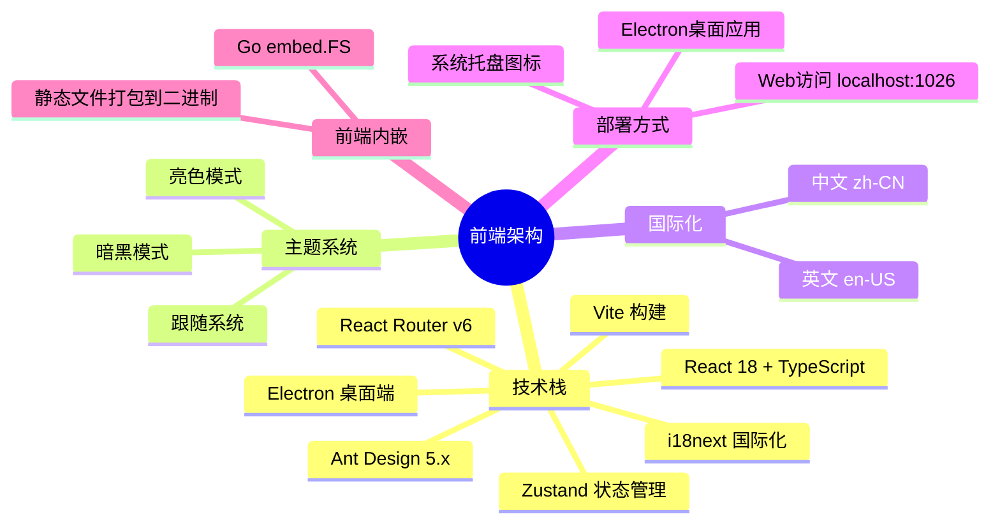
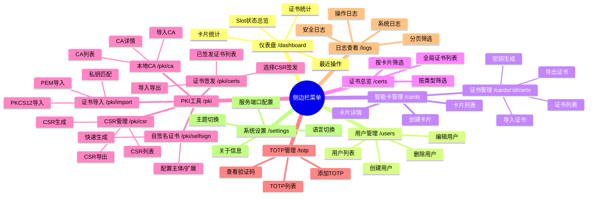
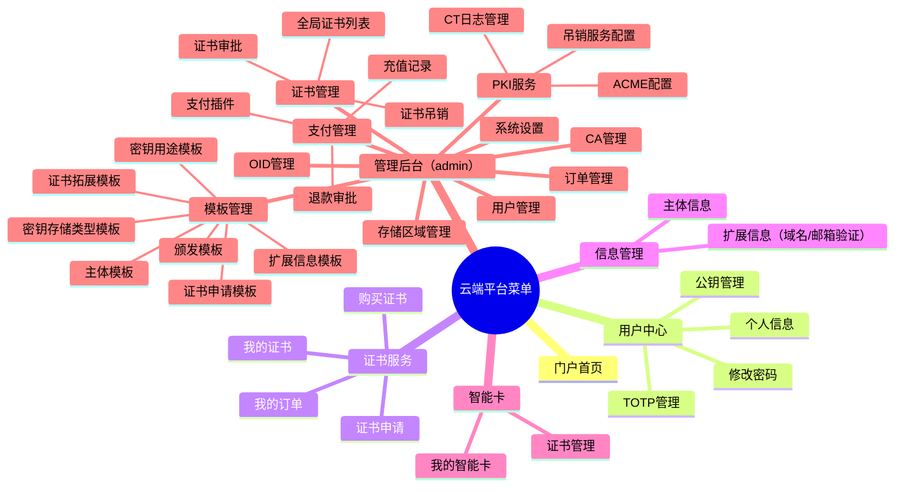

# OpenCert Manager — 前端设计与侧边栏菜单

> 文档版本：v2.0.0
> 最后更新：2026-04-17

---

## 一、前端架构总览



---

## 二、侧边栏菜单设计

### 2.1 本地管理端（client-card 前端）



### 2.2 侧边栏菜单结构（代码级）

```typescript
const menuItems = [
  {
    key: 'dashboard',
    icon: <DashboardOutlined />,
    label: '仪表盘',
    path: '/dashboard',
  },
  {
    key: 'users',
    icon: <UserOutlined />,
    label: '用户管理',
    path: '/users',
  },
  {
    key: 'cards',
    icon: <CreditCardOutlined />,
    label: '智能卡管理',
    path: '/cards',
  },
  {
    key: 'certs',
    icon: <SafetyCertificateOutlined />,
    label: '证书总览',
    path: '/certs',
  },
  {
    key: 'pki',
    icon: <KeyOutlined />,
    label: 'PKI 工具',
    children: [
      { key: 'pki-csr', label: 'CSR 管理', path: '/pki/csr' },
      { key: 'pki-ca', label: '本地 CA', path: '/pki/ca' },
      { key: 'pki-certs', label: '证书签发', path: '/pki/certs' },
      { key: 'pki-selfsign', label: '自签名证书', path: '/pki/selfsign' },
      { key: 'pki-import', label: '证书导入', path: '/pki/import' },
    ],
  },
  {
    key: 'totp',
    icon: <FieldTimeOutlined />,
    label: 'TOTP 管理',
    path: '/totp',
  },
  {
    key: 'logs',
    icon: <FileTextOutlined />,
    label: '日志查看',
    path: '/logs',
  },
  {
    key: 'settings',
    icon: <SettingOutlined />,
    label: '系统设置',
    path: '/settings',
  },
];
```

### 2.3 云端平台侧边栏（server-card 前端，未来扩展）



---

## 三、路由设计

### 3.1 本地管理端路由表

| 路由 | 组件 | 说明 | 认证 |
|------|------|------|------|
| `/login` | Login | 登录页 | ❌ |
| `/` | → `/dashboard` | 重定向 | ✅ |
| `/dashboard` | Dashboard | 仪表盘 | ✅ |
| `/users` | Users | 用户管理 | ✅ |
| `/cards` | Cards | 智能卡管理 | ✅ |
| `/cards/:id/certs` | — | 卡片内证书（在卡片详情中展示） | ✅ |
| `/certs` | Certs | 证书总览 | ✅ |
| `/pki` | PKI | PKI 工具（布局容器） | ✅ |
| `/pki/csr` | PKI/CSR | CSR 管理 | ✅ |
| `/pki/ca` | PKI/LocalCA | 本地 CA | ✅ |
| `/pki/certs` | PKI/Certs | 证书签发 | ✅ |
| `/pki/selfsign` | PKI/SelfSign | 自签名证书 | ✅ |
| `/pki/import` | PKI/ImportCert | 证书导入 | ✅ |
| `/totp` | TOTP | TOTP 管理 | ✅ |
| `/logs` | Logs | 日志查看 | ✅ |
| `/settings` | Settings | 系统设置 | ✅ |

### 3.2 路由守卫

- `PrivateRoute` 组件包裹需要认证的路由
- 未登录自动跳转到 `/login`
- 登录成功后跳转回原始请求路径

---

## 四、页面设计详情

### 4.1 登录页

| 元素 | 说明 |
|------|------|
| Logo | OpenCert Manager 品牌标识 |
| 用户选择 | 下拉选择已有用户或输入新用户 |
| 密码/PIN 输入 | 本地用户输入密码或 PIN |
| 云端登录 | 云端用户输入 API 地址 + 用户名 + 密码 |
| 记住登录 | 可选，使用 PIN 快速解锁 |

### 4.2 仪表盘

| 区域 | 内容 |
|------|------|
| 统计卡片 | Slot 数量、卡片数量、证书数量、TOTP 数量 |
| Slot 状态 | 各 Slot 类型的在线/离线状态 |
| 最近操作 | 最近 10 条操作日志 |
| 快捷操作 | 创建卡片、导入证书、生成密钥等快捷按钮 |

### 4.3 用户管理

| 功能 | 说明 |
|------|------|
| 用户列表 | 表格展示，支持搜索和筛选 |
| 创建用户 | 弹窗表单，选择本地/云端类型 |
| 编辑用户 | 修改显示名称、邮箱等 |
| 删除用户 | 二次确认，关联数据提示 |

### 4.4 智能卡管理

| 功能 | 说明 |
|------|------|
| 卡片列表 | 卡片式布局，显示类型、名称、证书数量 |
| 创建卡片 | 选择 Slot 类型、输入名称和密码 |
| 卡片详情 | 展开显示证书列表、卡片信息 |
| 解锁卡片 | 输入 PIN/密码解锁后才能操作证书 |
| 证书操作 | 导入、导出、删除、查看详情 |

### 4.5 PKI 工具

#### CSR 管理

| 功能 | 说明 |
|------|------|
| CSR 生成表单 | 主体信息（CN/O/OU/C/ST/L/Email）+ 扩展信息（SAN）+ 密钥配置 |
| 密钥存储选择 | 直接存储到数据库 / 智能卡上生成密钥 |
| CSR 列表 | 表格展示所有 CSR，支持导出 |
| CSR 详情 | 查看 CSR 的主体、扩展、公钥信息 |

#### 本地 CA

| 功能 | 说明 |
|------|------|
| 导入 CA | 上传 CA 证书 + 私钥（PEM/PKCS12） |
| CA 列表 | 表格展示，显示主体、有效期、状态 |
| 使用 CA 签发 | 选择 CSR + CA + 有效期 → 签发证书 |

#### 证书签发

| 功能 | 说明 |
|------|------|
| 签发表单 | 选择 CSR、CA、有效期、密钥用法、扩展用法 |
| 已签发列表 | 表格展示，支持导出 PEM/DER/PKCS12 |
| 导入到智能卡 | 将签发的证书导入到指定智能卡 |

#### 证书导入

| 功能 | 说明 |
|------|------|
| 导入方式选择 | PKCS12 / 私钥+证书 / 纯证书 / 仅私钥 |
| 自动匹配 | 导入纯证书时自动匹配已有私钥 |
| 目标选择 | 导入到数据库 / 指定智能卡 |

### 4.6 TOTP 管理

| 功能 | 说明 |
|------|------|
| TOTP 列表 | 卡片式布局，显示发行者、账户、当前验证码 |
| 添加 TOTP | 扫描二维码或手动输入密钥 |
| 验证码显示 | 实时显示 6/8 位验证码 + 倒计时进度条 |
| 复制验证码 | 一键复制到剪贴板 |

### 4.7 日志查看

| 功能 | 说明 |
|------|------|
| 日志列表 | 表格展示，支持分页 |
| 筛选 | 按类型、等级、时间范围筛选 |
| 详情 | 展开查看完整日志内容 |
| 完整性 | 审计日志显示哈希链完整性状态 |

### 4.8 系统设置

| 功能 | 说明 |
|------|------|
| 服务配置 | API 端口、IPC 路径 |
| 主题切换 | 亮色 / 暗黑 / 跟随系统 |
| 语言切换 | 中文 / English |
| 关于 | 版本信息、开源协议 |

---

## 五、组件设计

### 5.1 布局组件

```
MainLayout
├── Sider（侧边栏）
│   ├── Logo
│   ├── Menu（菜单项）
│   └── 折叠按钮
├── Header（顶部栏）
│   ├── 面包屑导航
│   ├── 主题切换
│   ├── 语言切换
│   └── 用户头像/登出
└── Content（内容区）
    └── <Outlet />（路由出口）
```

### 5.2 通用组件

| 组件 | 说明 |
|------|------|
| ErrorBoundary | 全局错误边界，捕获渲染错误 |
| PrivateRoute | 路由守卫，未登录重定向 |
| PageLoader | 懒加载占位 Spin |
| CertViewer | 证书详情查看器（解析 X509 字段） |
| KeyTypeSelect | 密钥类型选择器（RSA/ECC/EdDSA/SM2） |
| SubjectForm | 证书主体信息表单 |
| SANForm | SAN 扩展信息表单 |
| PasswordModal | 密码/PIN 输入弹窗 |

### 5.3 状态管理（Zustand）

```typescript
// appStore - 全局应用状态
interface AppStore {
  darkMode: boolean;
  themeMode: 'light' | 'dark' | 'system';
  locale: 'zh-CN' | 'en-US';
  collapsed: boolean;  // 侧边栏折叠
  setThemeMode: (mode: string) => void;
  setLocale: (locale: string) => void;
  toggleCollapsed: () => void;
}

// authStore - 认证状态
interface AuthStore {
  token: string | null;
  user: User | null;
  login: (credentials: LoginParams) => Promise<void>;
  logout: () => void;
}
```

---

## 六、Electron 集成

### 6.1 桌面端特性

| 特性 | 说明 |
|------|------|
| 系统托盘 | 最小化到托盘，右键菜单（打开/退出） |
| 系统通知 | 证书到期提醒、同步完成通知 |
| 开机自启 | 可选，配合 client-card 服务自启 |
| 窗口管理 | 记住窗口位置和大小 |

### 6.2 加载方式

```
Electron 主进程
  → 启动 client-card Go 服务（子进程）
  → 等待 :1026 端口就绪
  → 加载 http://localhost:1026
  → 创建系统托盘图标
```

---

## 七、响应式设计

| 断点 | 宽度 | 布局 |
|------|------|------|
| Desktop | ≥ 1200px | 侧边栏展开 + 内容区 |
| Tablet | 768px - 1199px | 侧边栏折叠 + 内容区 |
| Mobile | < 768px | 侧边栏隐藏，汉堡菜单 |

---

## 八、国际化

### 8.1 语言文件结构

```
src/i18n/
├── index.ts          # i18next 初始化
├── zh-CN/
│   ├── common.json   # 通用文本
│   ├── menu.json     # 菜单文本
│   ├── user.json     # 用户管理
│   ├── card.json     # 卡片管理
│   ├── cert.json     # 证书管理
│   ├── pki.json      # PKI 工具
│   └── settings.json # 设置
└── en-US/
    ├── common.json
    ├── menu.json
    └── ...
```

### 8.2 菜单国际化示例

```json
// zh-CN/menu.json
{
  "dashboard": "仪表盘",
  "users": "用户管理",
  "cards": "智能卡管理",
  "certs": "证书总览",
  "pki": "PKI 工具",
  "pki_csr": "CSR 管理",
  "pki_ca": "本地 CA",
  "pki_certs": "证书签发",
  "pki_selfsign": "自签名证书",
  "pki_import": "证书导入",
  "totp": "TOTP 管理",
  "logs": "日志查看",
  "settings": "系统设置"
}

// en-US/menu.json
{
  "dashboard": "Dashboard",
  "users": "Users",
  "cards": "Smart Cards",
  "certs": "Certificates",
  "pki": "PKI Tools",
  "pki_csr": "CSR Manager",
  "pki_ca": "Local CA",
  "pki_certs": "Issue Certs",
  "pki_selfsign": "Self-Signed",
  "pki_import": "Import Cert",
  "totp": "TOTP Manager",
  "logs": "Logs",
  "settings": "Settings"
}
```
