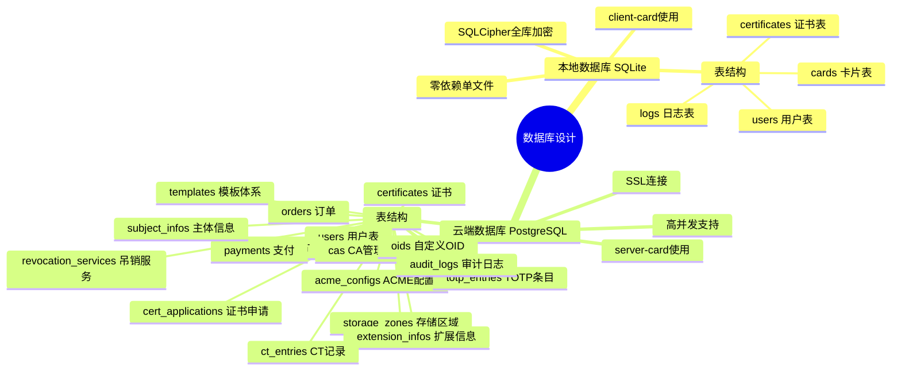

# OpenCert Manager — 数据库设计

> 文档版本：v2.0.0
> 最后更新：2026-04-17

---

## 一、数据库架构总览



---

## 二、本地数据库（SQLite / SQLCipher）

### 2.1 users 表（用户管理）

| 字段 | 类型 | 约束 | 说明 |
|------|------|------|------|
| uuid | TEXT | PRIMARY KEY | 用户唯一标识 |
| user_type | TEXT | NOT NULL | `local` / `cloud` |
| display_name | TEXT | NOT NULL | 显示名称 |
| email | TEXT | | 用户邮箱 |
| enabled | INTEGER | NOT NULL DEFAULT 1 | 是否启用 |
| password_hash | TEXT | | 本地：Argon2id/bcrypt 哈希；云端：留空 |
| cloud_url | TEXT | | 云端 API URL 地址 |
| auth_key | BLOB | | 云端：JWT Token；本地：加密的用户密码 |
| created_at | TEXT | NOT NULL | 创建时间（ISO 8601） |
| updated_at | TEXT | NOT NULL | 更新时间 |

### 2.2 cards 表（卡片管理）

| 字段 | 类型 | 约束 | 说明 |
|------|------|------|------|
| uuid | TEXT | PRIMARY KEY | 卡片唯一标识 |
| slot_type | TEXT | NOT NULL | `local` / `tpmv2` / `cloud` |
| card_name | TEXT | NOT NULL | 卡片显示名称 |
| user_uuid | TEXT | NOT NULL, FK → users.uuid | 所属用户 |
| card_keys | TEXT | NOT NULL | JSON 格式的加密主密钥列表 |
| pin_hash | TEXT | | PIN 码加密信息 |
| puk_hash | TEXT | | PUK 码加密信息 |
| admin_key_hash | TEXT | | Admin Key 加密信息 |
| pin_retries | INTEGER | NOT NULL DEFAULT 5 | PIN 剩余尝试次数 |
| puk_retries | INTEGER | NOT NULL DEFAULT 10 | PUK 剩余尝试次数 |
| tpm_platform | BLOB | | TPM2 Slot：TPM 封装的主密钥 blob |
| expires_at | TEXT | | 有效期 |
| remarks | TEXT | | 备注信息 |
| created_at | TEXT | NOT NULL | 创建时间 |
| updated_at | TEXT | NOT NULL | 更新时间 |

**card_keys JSON 结构**：

```json
{
  "keys": [
    {
      "type": "user",
      "user_uuid": "xxx",
      "salt": "base64...",
      "encrypted_master": "base64..."
    },
    {
      "type": "card_pin",
      "salt": "base64...",
      "encrypted_master": "base64..."
    }
  ]
}
```

### 2.3 certificates 表（证书管理）

| 字段 | 类型 | 约束 | 说明 |
|------|------|------|------|
| uuid | TEXT | PRIMARY KEY | 证书唯一标识 |
| slot_type | TEXT | NOT NULL | `local` / `tpmv2` / `cloud` |
| card_uuid | TEXT | NOT NULL, FK → cards.uuid | 所属卡片 |
| cert_type | TEXT | NOT NULL | `x509`/`ssh`/`gpg`/`totp`/`fido`/`login`/`secret`/`note`/`payment` |
| key_type | TEXT | | 密钥类型信息 |
| cert_content | BLOB | | 公开部分（证书/公钥/标签） |
| temp_key_salt | BLOB | | 临时密钥的 salt（32 字节） |
| temp_key_enc | BLOB | | 加密后的临时密钥 |
| private_data | BLOB | | 加密后的私密数据 |
| remarks | TEXT | | 备注信息 |
| created_at | TEXT | NOT NULL | 创建时间 |
| updated_at | TEXT | NOT NULL | 更新时间 |

### 2.4 logs 表（日志管理）

| 字段 | 类型 | 约束 | 说明 |
|------|------|------|------|
| uuid | TEXT | PRIMARY KEY | 日志唯一标识 |
| prev_hash | TEXT | | 前一条日志的 SHA-256 哈希（链式完整性） |
| log_type | TEXT | NOT NULL | `operation` / `security` / `system` |
| slot_type | TEXT | | 关联的 Slot 类型 |
| card_uuid | TEXT | | 关联的卡片 UUID |
| user_uuid | TEXT | | 关联的用户 UUID |
| level | TEXT | NOT NULL | `info` / `warn` / `error` |
| title | TEXT | NOT NULL | 日志标题 |
| content | TEXT | | 日志详细内容 |
| created_at | TEXT | NOT NULL | 记录时间 |

### 2.5 索引设计

```sql
-- users
CREATE INDEX idx_users_type ON users(user_type);
CREATE INDEX idx_users_email ON users(email);

-- cards
CREATE INDEX idx_cards_user ON cards(user_uuid);
CREATE INDEX idx_cards_slot ON cards(slot_type);

-- certificates
CREATE INDEX idx_certs_card ON certificates(card_uuid);
CREATE INDEX idx_certs_type ON certificates(cert_type);
CREATE INDEX idx_certs_slot ON certificates(slot_type);

-- logs
CREATE INDEX idx_logs_type ON logs(log_type);
CREATE INDEX idx_logs_level ON logs(level);
CREATE INDEX idx_logs_user ON logs(user_uuid);
CREATE INDEX idx_logs_card ON logs(card_uuid);
CREATE INDEX idx_logs_time ON logs(created_at);
```

---

## 三、云端数据库（PostgreSQL）

### 3.1 users 表

| 字段 | 类型 | 约束 | 说明 |
|------|------|------|------|
| uuid | UUID | PRIMARY KEY DEFAULT gen_random_uuid() | 用户唯一标识 |
| username | VARCHAR(64) | UNIQUE NOT NULL | 用户名 |
| display_name | VARCHAR(128) | NOT NULL | 显示名称 |
| email | VARCHAR(256) | UNIQUE NOT NULL | 邮箱 |
| password_hash | TEXT | NOT NULL | Argon2id 哈希 |
| role | VARCHAR(32) | NOT NULL DEFAULT 'user' | 角色 |
| enabled | BOOLEAN | NOT NULL DEFAULT true | 是否启用 |
| public_key_pem | TEXT | | 用户云端公钥（PEM） |
| totp_secret | TEXT | | TOTP 双因素密钥（加密存储） |
| totp_enabled | BOOLEAN | NOT NULL DEFAULT false | 是否启用 TOTP |
| login_attempts | INTEGER | NOT NULL DEFAULT 0 | 登录失败次数 |
| locked_until | TIMESTAMPTZ | | 锁定截止时间 |
| last_login_at | TIMESTAMPTZ | | 最后登录时间 |
| created_at | TIMESTAMPTZ | NOT NULL DEFAULT now() | 创建时间 |
| updated_at | TIMESTAMPTZ | NOT NULL DEFAULT now() | 更新时间 |

### 3.2 storage_zones 表（存储区域）

| 字段 | 类型 | 约束 | 说明 |
|------|------|------|------|
| uuid | UUID | PRIMARY KEY | 区域唯一标识 |
| name | VARCHAR(128) | NOT NULL | 区域名称 |
| storage_type | VARCHAR(32) | NOT NULL | `database` / `hsm` |
| hsm_driver | TEXT | | HSM 驱动路径 |
| hsm_config | JSONB | | HSM 配置信息（加密存储） |
| status | VARCHAR(32) | NOT NULL DEFAULT 'active' | 状态 |
| created_at | TIMESTAMPTZ | NOT NULL DEFAULT now() | 创建时间 |

### 3.3 cards 表（云端智能卡）

| 字段 | 类型 | 约束 | 说明 |
|------|------|------|------|
| uuid | UUID | PRIMARY KEY | 卡片唯一标识 |
| card_name | VARCHAR(128) | NOT NULL | 卡片名称 |
| user_uuid | UUID | NOT NULL, FK → users.uuid | 所属用户 |
| storage_zone_uuid | UUID | NOT NULL, FK → storage_zones.uuid | 所属存储区域 |
| security_level | VARCHAR(32) | NOT NULL DEFAULT 'medium' | 安全等级 |
| pin_data | JSONB | | PIN 加密信息 |
| puk_data | JSONB | | PUK 加密信息 |
| admin_key_data | JSONB | | Admin Key 加密信息 |
| pin_retries | INTEGER | NOT NULL DEFAULT 5 | PIN 剩余次数 |
| puk_retries | INTEGER | NOT NULL DEFAULT 10 | PUK 剩余次数 |
| expires_at | TIMESTAMPTZ | | 有效期 |
| remarks | TEXT | | 备注 |
| created_at | TIMESTAMPTZ | NOT NULL DEFAULT now() | 创建时间 |
| updated_at | TIMESTAMPTZ | NOT NULL DEFAULT now() | 更新时间 |

### 3.4 certificates 表

| 字段 | 类型 | 约束 | 说明 |
|------|------|------|------|
| uuid | UUID | PRIMARY KEY | 证书唯一标识 |
| card_uuid | UUID | FK → cards.uuid | 所属卡片（可为空） |
| user_uuid | UUID | NOT NULL, FK → users.uuid | 所属用户 |
| ca_uuid | UUID | FK → cas.uuid | 签发 CA |
| template_uuid | UUID | FK → issuance_templates.uuid | 使用的颁发模板 |
| order_uuid | UUID | FK → cert_orders.uuid | 关联订单 |
| cert_type | VARCHAR(32) | NOT NULL | `x509` / `gpg` / `ssh` |
| key_type | VARCHAR(32) | | 密钥类型 |
| status | VARCHAR(32) | NOT NULL DEFAULT 'valid' | `valid`/`revoked`/`expired` |
| subject_dn | TEXT | | 证书主体 DN |
| issuer_dn | TEXT | | 颁发者 DN |
| serial_hex | VARCHAR(128) | | 序列号（十六进制） |
| not_before | TIMESTAMPTZ | | 有效期起始 |
| not_after | TIMESTAMPTZ | | 有效期截止 |
| cert_pem | TEXT | | 证书 PEM |
| private_key_enc | BYTEA | | 加密后的私钥 |
| key_usage | INTEGER | | 密钥用法位掩码 |
| ext_key_usage | TEXT[] | | 扩展密钥用法 OID 列表 |
| san_dns | TEXT[] | | SAN DNS 名称 |
| san_ip | TEXT[] | | SAN IP 地址 |
| san_email | TEXT[] | | SAN 邮箱 |
| revoked_at | TIMESTAMPTZ | | 吊销时间 |
| revoke_reason | INTEGER | | 吊销原因码 |
| created_at | TIMESTAMPTZ | NOT NULL DEFAULT now() | 创建时间 |
| updated_at | TIMESTAMPTZ | NOT NULL DEFAULT now() | 更新时间 |

### 3.5 cas 表（CA 管理）

| 字段 | 类型 | 约束 | 说明 |
|------|------|------|------|
| uuid | UUID | PRIMARY KEY | CA 唯一标识 |
| name | VARCHAR(128) | NOT NULL | CA 名称 |
| parent_uuid | UUID | FK → cas.uuid | 上级 CA（根 CA 为空） |
| key_type | VARCHAR(32) | NOT NULL | 密钥类型 |
| status | VARCHAR(32) | NOT NULL DEFAULT 'active' | 状态 |
| subject_dn | TEXT | NOT NULL | CA 主体 DN |
| cert_pem | TEXT | NOT NULL | CA 证书 PEM |
| chain_pem | TEXT | | 证书链 PEM |
| private_key_enc | BYTEA | NOT NULL | 加密后的 CA 私钥 |
| not_before | TIMESTAMPTZ | NOT NULL | 有效期起始 |
| not_after | TIMESTAMPTZ | NOT NULL | 有效期截止 |
| issued_count | INTEGER | NOT NULL DEFAULT 0 | 已签发证书数 |
| crl_number | BIGINT | NOT NULL DEFAULT 0 | CRL 序号 |
| last_crl_at | TIMESTAMPTZ | | 最后 CRL 更新时间 |
| created_at | TIMESTAMPTZ | NOT NULL DEFAULT now() | 创建时间 |
| updated_at | TIMESTAMPTZ | NOT NULL DEFAULT now() | 更新时间 |

### 3.6 模板表

#### issuance_templates（证书颁发模板）

| 字段 | 类型 | 说明 |
|------|------|------|
| uuid | UUID PK | 模板唯一标识 |
| name | VARCHAR(128) | 模板名称 |
| category | VARCHAR(64) | 分类（ssl/codesign/email） |
| is_ca | BOOLEAN | 是否 CA 证书 |
| path_length | INTEGER | 路径长度约束 |
| validity_options | INTEGER[] | 可选有效期天数列表 |
| allowed_key_types | TEXT[] | 允许的密钥类型 |
| allowed_ca_uuids | UUID[] | 可颁发 CA 列表 |
| subject_template_uuid | UUID FK | 主体模板 |
| extension_template_uuid | UUID FK | 扩展信息模板 |
| key_usage_template_uuid | UUID FK | 密钥用途模板 |
| key_storage_template_uuid | UUID FK | 密钥存储类型模板 |
| cert_ext_template_uuid | UUID FK | 证书拓展模板 |
| price_cents | INTEGER | 价格（分） |
| stock | INTEGER | 库存（-1 无限） |
| enabled | BOOLEAN | 是否启用 |
| created_at | TIMESTAMPTZ | 创建时间 |

#### subject_templates（主体模板）

| 字段 | 类型 | 说明 |
|------|------|------|
| uuid | UUID PK | 模板唯一标识 |
| name | VARCHAR(128) | 模板名称 |
| fields | JSONB | 字段定义列表 |
| created_at | TIMESTAMPTZ | 创建时间 |

#### extension_templates（扩展信息模板）

| 字段 | 类型 | 说明 |
|------|------|------|
| uuid | UUID PK | 模板唯一标识 |
| name | VARCHAR(128) | 模板名称 |
| max_dns | INTEGER | DNS 最大数量 |
| max_email | INTEGER | 邮箱最大数量 |
| max_ip | INTEGER | IP 最大数量 |
| max_uri | INTEGER | URI 最大数量 |
| max_rid | INTEGER | RID 最大数量 |
| max_other | INTEGER | Other 最大数量 |
| require_dns_verify | BOOLEAN | DNS 是否需要验证 |
| require_email_verify | BOOLEAN | 邮箱是否需要验证 |
| require_ip_verify | BOOLEAN | IP 是否需要验证 |
| created_at | TIMESTAMPTZ | 创建时间 |

#### key_usage_templates（密钥用途模板）

| 字段 | 类型 | 说明 |
|------|------|------|
| uuid | UUID PK | 模板唯一标识 |
| name | VARCHAR(128) | 模板名称 |
| key_usage_bits | INTEGER | 密钥用法位掩码 |
| ext_key_usages | TEXT[] | 扩展密钥用法 OID 列表 |
| created_at | TIMESTAMPTZ | 创建时间 |

#### cert_ext_templates（证书拓展模板）

| 字段 | 类型 | 说明 |
|------|------|------|
| uuid | UUID PK | 模板唯一标识 |
| name | VARCHAR(128) | 模板名称 |
| crl_distribution_points | TEXT[] | CRL 分发点 |
| ocsp_servers | TEXT[] | OCSP 服务器 |
| aia_issuers | TEXT[] | AIA 颁发者信息 |
| ct_servers | TEXT[] | CT 服务器 |
| ev_policy_oid | TEXT | EV 策略 OID |
| netscape_config | JSONB | Netscape 相关配置 |
| csp_config | JSONB | CSP 配置 |
| asn1_extensions | JSONB | 自定义 ASN.1 扩展 |
| created_at | TIMESTAMPTZ | 创建时间 |

#### key_storage_templates（密钥存储类型模板）

| 字段 | 类型 | 说明 |
|------|------|------|
| uuid | UUID PK | 模板唯一标识 |
| name | VARCHAR(128) | 模板名称 |
| allowed_storage_types | TEXT[] | 允许的存储方式 |
| virtual_card_security_level | VARCHAR(32) | 虚拟卡安全等级 |
| allow_reimport | BOOLEAN | 是否允许重新导入 |
| cloud_backup | BOOLEAN | 是否云端备份 |
| allow_reissue | BOOLEAN | 是否允许重新下发 |
| max_reissue_count | INTEGER | 最大下发次数 |
| created_at | TIMESTAMPTZ | 创建时间 |

### 3.7 订单与支付表

#### cert_orders（证书订单）

| 字段 | 类型 | 说明 |
|------|------|------|
| uuid | UUID PK | 订单唯一标识 |
| user_uuid | UUID FK | 用户 |
| issuance_template_uuid | UUID FK | 颁发模板 |
| validity_days | INTEGER | 有效期天数 |
| key_type | VARCHAR(32) | 密钥类型 |
| amount_cents | INTEGER | 金额（分） |
| status | VARCHAR(32) | 状态 |
| paid_at | TIMESTAMPTZ | 支付时间 |
| created_at | TIMESTAMPTZ | 创建时间 |

#### cert_applications（证书申请）

| 字段 | 类型 | 说明 |
|------|------|------|
| uuid | UUID PK | 申请唯一标识 |
| cert_order_uuid | UUID FK | 关联订单 |
| user_uuid | UUID FK | 用户 |
| subject_info_uuid | UUID FK | 主体信息 |
| extension_info_uuids | UUID[] | 扩展信息列表 |
| key_type | VARCHAR(32) | 密钥类型 |
| status | VARCHAR(32) | 状态（pending/approved/rejected） |
| reject_reason | TEXT | 拒绝原因 |
| cert_uuid | UUID FK | 签发后的证书 |
| reviewed_by | UUID FK | 审批人 |
| reviewed_at | TIMESTAMPTZ | 审批时间 |
| created_at | TIMESTAMPTZ | 创建时间 |

#### payments（支付记录）

| 字段 | 类型 | 说明 |
|------|------|------|
| uuid | UUID PK | 支付唯一标识 |
| user_uuid | UUID FK | 用户 |
| amount_cents | INTEGER | 金额（分） |
| channel | VARCHAR(64) | 支付渠道 |
| status | VARCHAR(32) | 状态 |
| external_order_id | TEXT | 外部订单号 |
| created_at | TIMESTAMPTZ | 创建时间 |

### 3.8 其他表

#### subject_infos（主体信息）

| 字段 | 类型 | 说明 |
|------|------|------|
| uuid | UUID PK | 唯一标识 |
| user_uuid | UUID FK | 用户 |
| subject_template_uuid | UUID FK | 主体模板 |
| fields | JSONB | 字段值 |
| status | VARCHAR(32) | 审核状态 |
| created_at | TIMESTAMPTZ | 创建时间 |

#### extension_infos（扩展信息验证）

| 字段 | 类型 | 说明 |
|------|------|------|
| uuid | UUID PK | 唯一标识 |
| user_uuid | UUID FK | 用户 |
| type | VARCHAR(32) | domain/email/ip |
| value | TEXT | 域名/邮箱/IP |
| verify_token | TEXT | 验证令牌 |
| status | VARCHAR(32) | pending/verified/expired |
| verified_at | TIMESTAMPTZ | 验证时间 |
| expires_at | TIMESTAMPTZ | 过期时间 |
| created_at | TIMESTAMPTZ | 创建时间 |

#### oids（自定义 OID）

| 字段 | 类型 | 说明 |
|------|------|------|
| uuid | UUID PK | 唯一标识 |
| oid | VARCHAR(256) UNIQUE | OID 值 |
| name | VARCHAR(128) | 显示名称 |
| description | TEXT | 描述 |
| usage_type | VARCHAR(64) | 用途分类 |
| asn1_type | VARCHAR(64) | ASN.1 类型 |
| created_at | TIMESTAMPTZ | 创建时间 |

#### revocation_services（吊销服务配置）

| 字段 | 类型 | 说明 |
|------|------|------|
| uuid | UUID PK | 唯一标识 |
| ca_uuid | UUID FK | 关联 CA |
| service_type | VARCHAR(32) | crl/ocsp/caissuer |
| path | TEXT | 服务路径 |
| enabled | BOOLEAN | 是否启用 |
| update_interval_min | INTEGER | 更新间隔（分钟） |
| created_at | TIMESTAMPTZ | 创建时间 |

#### acme_configs（ACME 配置）

| 字段 | 类型 | 说明 |
|------|------|------|
| uuid | UUID PK | 唯一标识 |
| path | VARCHAR(128) UNIQUE | ACME 路径 |
| ca_uuid | UUID FK | 签发 CA |
| issuance_template_uuid | UUID FK | 颁发模板 |
| enabled | BOOLEAN | 是否启用 |
| created_at | TIMESTAMPTZ | 创建时间 |

#### audit_logs（审计日志）

| 字段 | 类型 | 说明 |
|------|------|------|
| uuid | UUID PK | 唯一标识 |
| prev_hash | VARCHAR(64) | 前一条哈希 |
| user_uuid | UUID | 操作用户 |
| action | VARCHAR(128) | 操作类型 |
| resource_type | VARCHAR(64) | 资源类型 |
| resource_uuid | UUID | 资源 UUID |
| detail | JSONB | 详细信息 |
| ip_address | VARCHAR(45) | 客户端 IP |
| created_at | TIMESTAMPTZ | 记录时间 |

---

## 四、数据库迁移策略

- 使用 Go 内嵌 SQL 迁移脚本
- 版本号递增管理（v001, v002, ...）
- 启动时自动检测并执行未应用的迁移
- 支持回滚（down migration）
