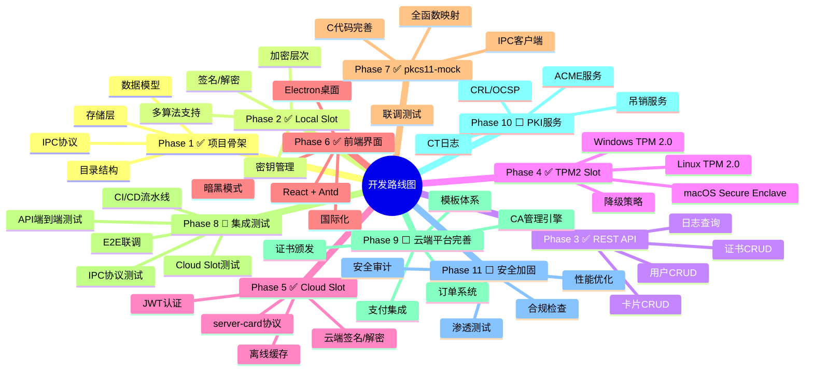

# OpenCert Manager — 开发路线图与里程碑

> 文档版本：v2.0.0
> 最后更新：2026-04-17

---

## 一、开发路线图总览



---

## 二、分阶段详细计划

### Phase 1：项目骨架 ✅ 已完成

| 任务 | 状态 | 说明 |
|------|------|------|
| 目录结构搭建 | ✅ | cmd/internal/pkg/test 标准布局 |
| 数据模型定义 | ✅ | users/cards/certificates/logs 四表 |
| IPC 协议设计 | ✅ | 二进制帧头 + JSON Payload |
| SQLite 存储层 | ✅ | 初始化 + 迁移 + Repository |
| 配置加载 | ✅ | YAML/ENV 配置 |

### Phase 2：Local Slot 实现 ✅ 已完成

| 任务 | 状态 | 说明 |
|------|------|------|
| SlotProvider 接口 | ✅ | 统一抽象接口 |
| 三层加密架构 | ✅ | 用户密码→主密钥→临时密钥→私钥 |
| 密钥生成 | ✅ | RSA/ECC/EdDSA/SM2 |
| 签名操作 | ✅ | PKCS1v15/PSS/ECDSA/EdDSA |
| 解密操作 | ✅ | RSA-PKCS1v15/RSA-OAEP |
| 加密操作 | ✅ | AES-GCM/CBC/ChaCha20 |

### Phase 3：REST API 服务 ✅ 已完成

| 任务 | 状态 | 说明 |
|------|------|------|
| HTTP 服务器 | ✅ | Go 1.22 标准库 net/http |
| 用户 CRUD | ✅ | 创建/读取/更新/删除 |
| 卡片 CRUD | ✅ | 创建/读取/更新/删除 |
| 证书 CRUD | ✅ | 导入/读取/删除 |
| 密钥生成 API | ✅ | POST /api/cards/{uuid}/keygen |
| 日志查询 | ✅ | 分页 + 筛选 |
| 统一响应格式 | ✅ | { "data": ... } / { "error": ... } |

### Phase 4：TPM2 Slot 实现 ✅ 已完成

| 任务 | 状态 | 说明 |
|------|------|------|
| TPM 抽象接口 | ✅ | Seal/Unseal/Available |
| Windows/Linux 实现 | ✅ | go-tpm 库 |
| macOS 实现 | ✅ | Security.framework CGO |
| Mock 实现 | ✅ | 测试用 |
| 降级策略 | ✅ | TPM 不可用时自动降级 |

### Phase 5：Cloud Slot + server-card ✅ 已完成

| 任务 | 状态 | 说明 |
|------|------|------|
| server-card API 设计 | ✅ | JWT 认证 + 卡片/证书/签名 |
| Cloud Slot 实现 | ✅ | REST 转发 + 本地缓存 |
| JWT 认证 | ✅ | 登录/刷新/登出 |
| 云端签名/解密 | ✅ | 私钥不离开服务器 |

### Phase 6：前端管理界面 ✅ 已完成

| 任务 | 状态 | 说明 |
|------|------|------|
| React + Antd 搭建 | ✅ | Vite 构建 |
| 页面路由 | ✅ | React Router v6 |
| 仪表盘 | ✅ | Slot 状态总览 |
| 用户/卡片/证书管理 | ✅ | CRUD 页面 |
| PKI 工具 | ✅ | CSR/CA/签发/自签名/导入 |
| TOTP 管理 | ✅ | 添加/查看验证码 |
| 暗黑模式 | ✅ | 亮色/暗黑/跟随系统 |
| 国际化 | ✅ | 中/英双语 |
| Electron 集成 | ✅ | 桌面端 + 系统托盘 |

### Phase 7：pkcs11-mock C 代码 ✅ 已完成

| 任务 | 状态 | 说明 |
|------|------|------|
| IPC 客户端 | ✅ | Named Pipe / Unix Socket |
| 全函数映射 | ✅ | 28 个 PKCS#11 函数 |
| 心跳机制 | ✅ | 30 秒间隔 |
| 重连逻辑 | ✅ | 3 次无响应重连 |
| 线程安全 | ✅ | 互斥锁保护 |

### Phase 8：集成测试与 CI/CD 🚧 进行中

| 任务 | 状态 | 说明 |
|------|------|------|
| 单元测试 | ✅ | storage_test / local_slot_test |
| API 端到端测试 | ✅ | api_test.go |
| IPC 协议测试 | ✅ | ipc_test.go |
| Cloud Slot 测试 | ✅ | cloud_slot_test.go |
| E2E 联调测试 | ⬜ | pkcs11-mock + client-card |
| CI 流水线 | ✅ | GitHub Actions 三平台矩阵 |
| Beta 发布 | ✅ | tag v*-beta* 触发 |

### Phase 9：云端平台完善 ⬜ 待开始

| 任务 | 状态 | 说明 |
|------|------|------|
| CA 管理引擎 | ⬜ | 创建/导入/证书链/吊销 |
| 模板体系实现 | ⬜ | 6 种模板 CRUD |
| 证书颁发引擎 | ⬜ | 基于模板的证书签发 |
| 订单系统 | ⬜ | 创建/支付/申请/审批 |
| 支付集成 | ⬜ | 多插件架构 |
| 主体/扩展信息管理 | ⬜ | 审核流程 + 验证 |
| OID 管理 | ⬜ | 自定义 OID CRUD |
| 存储区域管理 | ⬜ | 数据库/HSM 存储 |
| 用户自助功能 | ⬜ | 购买/申请/管理 |
| 门户首页 | ⬜ | 产品展示页 |

### Phase 10：PKI 服务 ⬜ 待开始

| 任务 | 状态 | 说明 |
|------|------|------|
| ACME 服务 | ⬜ | RFC 8555 兼容 |
| CRL 服务 | ⬜ | 定时生成 + 分发 |
| OCSP 服务 | ⬜ | 在线查询响应 |
| CAIssuer 服务 | ⬜ | CA 证书下载 |
| CT 日志服务 | ⬜ | 提交 + 查询 |
| 吊销服务管理 | ⬜ | 按 CA 配置 |

### Phase 11：安全加固与发布 ⬜ 待开始

| 任务 | 状态 | 说明 |
|------|------|------|
| 安全审计 | ⬜ | 代码审查 + 漏洞扫描 |
| 渗透测试 | ⬜ | API + IPC 安全测试 |
| 性能优化 | ⬜ | 基准测试 + 瓶颈分析 |
| 文档完善 | ⬜ | 用户手册 + API 文档 |
| 正式发布 | ⬜ | v1.0.0 |

---

## 三、当前待解决问题

| 问题 | 优先级 | 说明 |
|------|--------|------|
| TPM2 macOS 方案 | 中 | Secure Enclave CGO 绑定验证，备选 Keychain |
| 前端内嵌 | 低 | embed.FS 与 Vite 构建产物集成方式确认 |
| pkcs11-mock 连接重试 | 中 | C 代码处理 client-card 未启动时的重连逻辑 |
| Cloud Slot 离线缓存 | 中 | 证书缓存 TTL 和强制刷新策略设计 |
| 多用户权限 | 高 | 同一张卡片多用户共享时的 CardKeys 管理逻辑 |
| E2E 测试 | 高 | pkcs11-mock + client-card 完整联调测试 |

---

## 四、CI/CD 流水线

```
.github/workflows/
├── ci.yml              # 主 CI（测试/构建/安全扫描，三平台矩阵）
│   ├── ubuntu-latest   # Linux 构建 + 测试
│   ├── windows-latest  # Windows 构建 + 测试
│   └── macos-latest    # macOS 构建 + 测试
└── release-beta.yml    # Beta 发布（tag v*-beta* 触发）
    └── 自动创建 pre-release + 构建产物上传
```

---

## 五、版本规划

| 版本 | 内容 | 预计时间 |
|------|------|---------|
| v0.1.0-beta | Phase 1-3：基础功能 | ✅ 已完成 |
| v0.2.0-beta | Phase 4-5：TPM2 + Cloud Slot | ✅ 已完成 |
| v0.3.0-beta | Phase 6-7：前端 + 驱动 | ✅ 已完成 |
| v0.4.0-beta | Phase 8：集成测试 | 🚧 进行中 |
| v0.5.0-beta | Phase 9：云端平台 | ⬜ 规划中 |
| v0.6.0-beta | Phase 10：PKI 服务 | ⬜ 规划中 |
| v1.0.0 | Phase 11：正式发布 | ⬜ 规划中 |
